# AoE3 DE Modding Code Wiki

A continuously-updated, structured knowledge base for Age of Empires III:
Definitive Edition modding — patterned after [Google Code
Wiki](https://developers.googleblog.com/introducing-code-wiki-accelerating-your-code-understanding/):
**hierarchical** (concept → schema → code), **cross-referenced** to
this repo's actual paths, and **versioned** with the mod.

## What this is

- Living documentation of every AoE3 DE modding subsystem we've
  reverse-engineered or learned about — from BAR archives to picker UI
  rendering.
- Each entry is **authoritative** within its scope: cites the source
  (Heaven tutorial, eBaeza Resource Manager, our own experiments with
  receipts, etc.) and clearly marks **open questions** where docs are
  thin.
- Designed to be the public artifact this mod team contributes back to
  the AoE3 DE community.

## Structure

```mermaid
graph TD
    root[modding overview] --> ff[file-formats]
    root --> dl[data-layer]
    root --> ul[ui-layer]
    root --> al[ai-layer]
    root --> v[validation]
    root --> mp[modding-pitfalls]
    ff --> bar[bar.md]
    ff --> xmb[xmb.md]
    ff --> ddt[ddt.md]
    ff --> l33t[l33t.md]
    dl --> cm[civmods.md]
    dl --> sm[stringmods.md]
    dl --> tt[techtreemods.md]
    dl --> hc[homecity.md]
    dl --> per[personalities.md]
    ul --> sc[select-civilization.md]
    ul --> shc[select-home-city.md]
    ul --> aip[ai-personality-picker.md]
    ul --> fr[flag-rendering.md]
    ul --> pr[portrait-rendering.md]
    al --> xs[xs-scripts.md]
    dl --> pm[protomods.md]
    v --> sg[static-gate.md]
    v --> em[engine-merge-dump.md]
    mp --> cs[case-sensitivity.md]
    mp --> dp[picker-doubles.md]
    mp --> gp[generic-portraits.md]
```

## Index

### Foundations
- [Mod folder structure](mod-folder-structure.md) — `modinfo.json`, `data/`, `art/`, `game/ai/`, `resources/` layout
- [Additive data mods](additive-data-mods.md) — `mergeMode` semantics, match keys, default-merge gotchas

### File formats (binary)
- [BAR archives](file-formats/bar.md) — `ESPN` magic, file table, alz4 compression
- [XMB binary XML](file-formats/xmb.md) — `X1` magic, version 8, embedded string table
- [DDT textures](file-formats/ddt.md) — `RTS3` magic, DXT-compressed, mipmap chain
- [l33t/zlib wrapper](file-formats/l33t.md) — used by `.age3Yrec` replays + `.age3Yscn` scenarios

### Data layer (XML)
- [civmods.xml](data-layer/civmods.md) — civ definitions, additive merge into base civs.xml
- [stringmods.xml](data-layer/stringmods.md) — `_locID` system, dedup pitfalls
- [techtreemods.xml](data-layer/techtreemods.md) — tech entries, mode-specific tech, age progression
- [protomods.xml](data-layer/protomods.md) — additive prototype-unit table
- [homecity XML](data-layer/homecity.md) — home city definitions, hero/city name resolution
- [.personality files](data-layer/personalities.md) — AI personality registration

### UI layer (rendering)
- [SELECT CIVILIZATION picker](ui-layer/select-civilization.md) — main civ picker
- [SELECT HOME CITY picker](ui-layer/select-home-city.md) — saved profile picker
- [AI Personality picker](ui-layer/ai-personality-picker.md) — opponent civ dropdown
- [Flag rendering](ui-layer/flag-rendering.md) — sprite sheets, fallback chain, the slash bug
- [Portrait rendering](ui-layer/portrait-rendering.md) — `cpai_avatar_*` paths, DDT vs WPF

### AI layer
- [XS scripts](ai-layer/xs-scripts.md) — DE limitations, log markers, debugger status

### Validation
- [Static gate](validation/static-gate.md) — ~80 offline validators
- [Engine merge dump](validation/engine-merge-dump.md) — `DebugOutputGameData` post-merge XML

### Modding pitfalls (lessons learned)
- [Case-sensitivity in additive merge](modding-pitfalls/case-sensitivity.md) — `<Civ>` vs `<civ>` drops all entries
- [Picker doubles](modding-pitfalls/picker-doubles.md) — base civ saved profiles vs ANW defaults
- [Generic AI portraits](modding-pitfalls/generic-portraits.md) — `<smallportraittexture>` overrides custom WPF
- [Missing flags / forward slashes](modding-pitfalls/missing-flags.md) — wpf paths require backslashes (open)

### Game data formats
- [Replays and scenarios](replays-scenarios.md) — `.age3Yrec` / `.age3Yscn` inner stream layouts

### Community context
- [Multi-civ mod architecture](multi-civ-architecture.md) — WoL, Improvement Mod, Hundred Days patterns + testing/QA state of practice
- [Community tools](community-tools.md) — Resource Manager, DDT Photoshop plugin, replay tools, what does NOT exist

## Conventions

- Every page starts with a 1-line summary, then sections: **Format / Schema**, **Cross-references**, **Tools**, **Known issues**, **Open questions**.
- Code/file paths in `inline backticks`. Cross-refs use markdown links to repo paths.
- Source attribution: every claim has a source — repo experiment, web doc, or `(unverified)` if assumed.
- Open questions explicitly marked `> ⚠ OPEN: …` so they're greppable.
- Mermaid diagrams for non-trivial relationships.

## Contributing / extending

- Each session adds new findings — append to the relevant page or create a new one.
- Validators in `tools/validation/` should reference the wiki page they enforce.
- When the engine surprises us, document the surprise in the appropriate `modding-pitfalls/` page.
- Keep `(unverified)` claims separate from sourced ones.

## Status

Currently populating — this index will fill in as pages land. See
[`changelog.md`](changelog.md) for what was added when.
