# Unit Index

*Auto-generated by `tools/validation/build_unit_index.py` on 2026-06-06T15:30:08. Do not edit by hand.*

Every createable unit in the mod (416 units across 44 civilizations), cross-referenced from `proto.xml` (stats), `resolved_rosters.json` (which nation can create each unit) and the extracted in-game icons.

Columns: **Icon** · **Unit** · **Age** · **HP** · **Armor** · **Attack** · **Cost** · **Pop** · **Nations that can create it**.

| Icon | Unit | Age | HP | Armor | Attack | Cost | Pop | Nations |
|------|------|----:|---:|-------|--------|------|----:|---------|
| 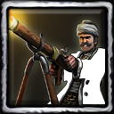 | `AbusGun` | 1 | 130 | 20% Ranged | 36 Siege (rng 18); 10 Hand | 50 Food, 105 Gold | 2 | Barbary, Egyptians, Ottomans |
| 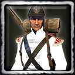 | `Cacadore` | 2 | 110 | 45% Ranged | 18 Ranged (rng 20); 12 Siege | 80 Food, 35 Gold | 1 | Brazil, Indonesians, Portuguese |
| 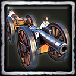 | `Cannon` | 3 | 475 | 75% Ranged | 200 Siege (rng 28) | 200 Wood, 600 Gold | 7 | Argentines, BajaCalifornians, Brazil, Californians, CentralAmericans, Chileans, Columbians, Dutch, Finnish, French, Germans, Haitians, Haudenosaunee, Hausa, Hungarians, Indonesians, Maltese, Mayans, Mexicans, NapoleonicFrance, Peruvians, Portuguese, RevFrance, RioGrande, Romanians, Russians, SouthAfricans, Spanish, Swedes, Texians, USA |
| 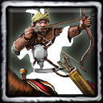 | `CavalryArcher` | 2 | 265 | 30% Hand | 13 Ranged (rng 12); 8 Siege | 100 Food, 60 Gold | 2 | Egyptians, Ottomans, Romanians, Russians |
| 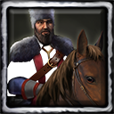 | `Cossack` | 1 | 225 | 30% Ranged | 26 Hand; 15 Siege | 75 Food, 75 Gold | 1 | Russians |
| 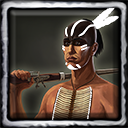 | Coureur des Bois `Coureur` | 0 | 180 | 40% Ranged | 10 Hand (rng 2); 8 Ranged (rng 12) | 120 Food | 1 | French |
| 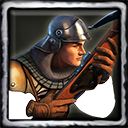 | `Crossbowman` | 1 | 100 | 20% Ranged | 16 Ranged (rng 16); 10 Siege (rng 18) | 40 Food, 40 Wood | 1 | Argentines, Brazil, Chileans, Columbians, French, Germans, Haitians, Hungarians, Indonesians, Maltese, Mexicans, NapoleonicFrance, Peruvians, Portuguese, RevFrance, Romanians, Spanish, Swedes |
| 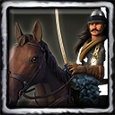 | `Cuirassier` | 2 | 425 | 20% Ranged | 25 Siege; 25 Hand | 150 Food, 150 Gold | 3 | French, Haitians, Haudenosaunee, NapoleonicFrance, RevFrance, Romanians |
| 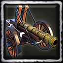 | `Culverin` | 2 | 280 | 75% Ranged | 40 Siege (rng 34) | 100 Wood, 400 Gold | 4 | Argentines, BajaCalifornians, Barbary, Brazil, British, Californians, Canadians, CentralAmericans, Chileans, Columbians, Dutch, Egyptians, Finnish, French, Germans, Haitians, Hungarians, Indonesians, Italians, Maltese, Mexicans, NapoleonicFrance, Ottomans, Peruvians, Portuguese, RevFrance, RioGrande, Romanians, Russians, SouthAfricans, Spanish, Swedes, Texians, USA |
| 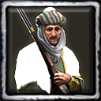 | `deAllegianceBarbaryMarksman` | 1 | 110 | 40% Ranged | 15 Ranged (rng 20); 12 Siege (rng 8) | 35 Food, 80 Gold | 2 | Argentines, Barbary, Brazil, British, Canadians, Chileans, Columbians, Dutch, Egyptians, Finnish, French, Germans, Haitians, Hausa, Hungarians, Indonesians, Italians, Maltese, NapoleonicFrance, Ottomans, Peruvians, Portuguese, RevFrance, Romanians, Russians, SouthAfricans, Spanish, Swedes |
| 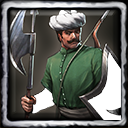 | `deAzap` | 1 | 120 | 20% Ranged | 20 Siege (rng 6); 10 Hand | 60 Food, 40 Wood | 1 | Barbary, Egyptians, Ottomans |
| 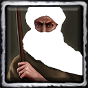 | `deBarbaryCavalry` | 1 | 210 | 20% Ranged | 28 Hand; 15 Siege | 65 Food, 65 Gold | 1 | Barbary |
| 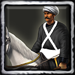 | `deBedouinHorseArcher` | 2 | 265 | 40% Hand | 15 Ranged (rng 16); 8 Siege | 100 Food, 60 Gold | 2 | Barbary |
| 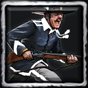 | `deBersagliere` | 3 | 120 | 25% Ranged | 16 Ranged (rng 25); 11 Siege | 50 Food, 75 Gold | 1 | Italians |
| 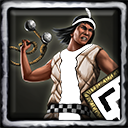 | `deBolasWarrior` | 2 | 140 | 20% Ranged | 19 Siege; 15 Ranged (rng 12) | 75 Food, 45 Gold | 1 | Inca |
| 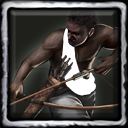 | `deBowmanLevy` | 0 | 100 | 20% Ranged | 16 Ranged (rng 16); 7 Hand | 70 Influence | 1 | Ethiopians, Hausa |
|  | `deCarolean` | 1 | 150 | 20% Hand | 20 Siege; 20 Hand | 65 Food, 40 Gold | 1 | Finnish, Swedes |
| 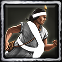 | `deChasqui` | 0 | 120 | 20% Ranged | 6 Hand; 5 Siege | 50 Wood, 50 Gold | — | Argentines, Aztecs, BajaCalifornians, Barbary, Brazil, British, Californians, Canadians, CentralAmericans, Chileans, Chinese, Columbians, Dutch, Egyptians, Ethiopians, Finnish, French, Germans, Haitians, Haudenosaunee, Hausa, Hungarians, Inca, Indians, Indonesians, Italians, Japanese, Lakota, Maltese, Mayans, Mexicans, NapoleonicFrance, Ottomans, Peruvians, Portuguese, RevFrance, RioGrande, Romanians, Russians, SouthAfricans, Spanish, Swedes, Texians, USA |
| 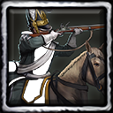 | `deChevauleger` | 2 | 235 | 20% Ranged | 26.5 Hand; 19.5 Ranged (rng 12) | 110 Food, 90 Gold | 2 | Germans |
|  | `deChinaco` | 1 | 290 | 20% Ranged | 25 Hand (rng 3.8); 20 Siege | 110 Food, 90 Gold | 2 | BajaCalifornians, Californians, CentralAmericans, Mayans, Mexicans, RioGrande, Spanish, Texians |
|  | `deColonialMilitia` | 2 | 200 | 30% Hand | 24 Ranged (rng 12); 20 Siege | 100 Food | 1 | Italians |
|  | `deConsulateAzap` | 1 | 120 | 20% Ranged | 20 Siege (rng 6); 10 Hand | 60 Food, 40 Wood | 1 | Indians |
|  | `deConsulateCacadore` | 2 | 110 | 45% Ranged | 18 Ranged (rng 20); 12 Siege | 80 Food, 35 Gold | 1 | Brazil, Dutch, Italians, Maltese, Portuguese |
| 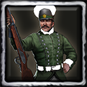 | `deConsulateCounterJaeger` | 1 | 120 | 30% Ranged | 16 Hand; 13.5 Ranged (rng 20) | 60 Food, 60 Gold | 1 | Chinese |
|  | `deConsulateLongbowman` | 1 | 95 | 30% Ranged | 16 Ranged (rng 22); 11 Hand | 60 Food, 40 Wood | 1 | Maltese |
| 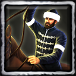 | `deConsulateOprichnik` | 2 | 250 | 20% Ranged | 64 Siege; 20 Hand | 90 Food, 60 Gold | 2 | Maltese |
|  | `deConsulateRocket` | 3 | 350 | 75% Ranged | 300 Siege (rng 28) | 100 Wood, 500 Gold | 6 | Indians |
|  | `deConsulateSoldado` | 1 | 300 | 25% Hand | 36 Ranged (rng 12); 32 Siege (rng 9) | 90 Food, 80 Gold | 2 | Brazil, Dutch, Italians, Portuguese |
| 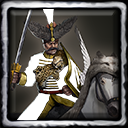 | `deDeli` | 1 | 315 | 20% Ranged | 25 Hand; 15 Siege | 110 Food, 90 Gold | 2 | Barbary, Egyptians, Ottomans |
| 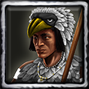 | `deEagleScout` | 0 | 80 | 10% Ranged | 10 Hand; 10 Ranged (rng 12) | 80 Food | — | Aztecs |
| 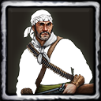 | `deEmboscador` | 1 | 110 | 30% Ranged | 17 Ranged (rng 18); 12 Siege | 60 Food, 60 Gold | 1 | BajaCalifornians, Californians, CentralAmericans, Mayans, Mexicans, RioGrande |
| 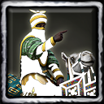 | `deEmir` | 0 | 400 | 10% Ranged | 30 Ranged (rng 16); 12 Siege | 100 Influence | — | Hausa |
|  | `deFinnishRider` | 2 | 210 | 20% Ranged | 30 Hand; 20 Ranged (rng 10) | 90 Food, 100 Gold | 2 | Finnish, Russians, Swedes |
| 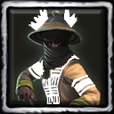 | `deFulaWarrior` | 1 | 120 | 20% Ranged | 13 Ranged (rng 21); 10 Hand | 70 Food, 35 Wood | 1 | Hausa |
| 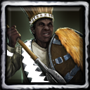 | `deGascenya` | 1 | 135 | 20% Hand | 24 Ranged (rng 13); 22 Siege | 70 Food, 30 Wood | 1 | Ethiopians |
|  | `deGeneral` | 0 | 500 | 10% Ranged | 750 Ranged (rng 16); 15 Siege | 100 Gold | — | BajaCalifornians, Californians, CentralAmericans, Mayans, Mexicans, RioGrande, Texians, USA |
|  | `deGrandMaster` | 0 | 500 | 10% Ranged | 750 Ranged (rng 16); 200 Hand | 100 Gold | — | Maltese |
| 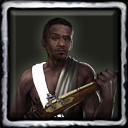 | `deGunnerLevy` | 0 | 150 | 20% Hand | 23 Ranged (rng 12); 13 Hand | 90 Influence | 1 | Ethiopians, Hausa |
| 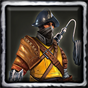 | `deHoopThrower` | 1 | 120 | 35% Ranged | 34 Siege (rng 22); 12 Hand | 50 Wood, 75 Gold | 2 | Italians, Maltese |
|  | `deHospitaller` | 1 | 250 | 20% Hand | 45 Siege; 40 Ranged (rng 14) | 120 Food, 80 Gold | 2 | Italians, Maltese |
| 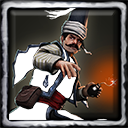 | `deHumbaraci` | 1 | 225 | 30% Ranged, 20% Siege | 50 Siege (rng 14); 28 Hand | 110 Food, 80 Gold | 2 | Barbary, Egyptians, Ottomans |
|  | `deIncaRunner` | 1 | 140 | 10% Ranged | 19 Hand; 9 Siege | 75 Food, 40 Gold | 1 | Inca |
|  | `deIncaSpearman` | 1 | 170 | 20% Hand | 35 Siege; 13 Hand | 100 Food, 25 Wood | 1 | Inca |
| 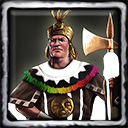 | `deIncaWarChief` | 0 | 500 | 30% Hand | 250 Siege (rng 16); 46 Ranged (rng 24) | 200 Gold | — | Inca |
|  | `deInsurgente` | 1 | 90 | 10% Hand | 20 Siege; 15 Ranged (rng 12) | 70 Food | 1 | BajaCalifornians, Californians, CentralAmericans, Mayans, Mexicans, Peruvians, Portuguese, RioGrande, Spanish |
| 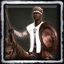 | `deJavelinRider` | 1 | 160 | 10% Ranged | 10 Ranged (rng 12); 10 Siege | 65 Food, 50 Gold | 1 | Ethiopians, Hausa |
| 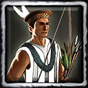 | `deJungleBowman` | 1 | 90 | 20% Ranged | 15 Ranged (rng 16); 10 Hand | 80 Food, 25 Wood | 1 | Inca |
|  | `deLandwehr` | 1 | 100 | 20% Ranged | 20 Ranged (rng 16); 16 Siege | 40 Food, 40 Wood | 1 | Germans |
| 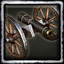 | `deLeatherCannon` | 1 | 170 | 50% Ranged | 40 Siege (rng 21) | 300 Food, 100 Wood | 3 | Swedes |
| 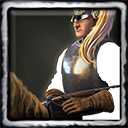 | `deLegionDragoon` | 2 | 200 | 20% Ranged | 22 Ranged (rng 12); 11 Hand | 90 Food, 90 Gold | 2 | Argentines, British, Canadians, French, Germans, Haudenosaunee, Italians, Spanish, USA |
| 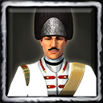 | `deLegionGrenadier` | 1 | 200 | 50% Ranged | 41 Siege (rng 12); 24 Hand | 120 Food, 60 Gold | 2 | British, Dutch, French, Italians, Swedes, USA |
|  | `deLegionMagyarHussar` | 1 | 640 | 20% Ranged | 30 Hand; 20 Siege | 180 Food, 120 Gold | 3 | Hungarians, USA |
|  | `deLifidi` | 2 | 375 | 15% Hand, 20% Ranged | 25 Hand; 15 Siege | 110 Food, 110 Gold | 2 | Hausa |
| 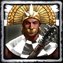 | `deMaceman` | 2 | 260 | 20% Ranged, 10% Siege | 72 Siege; 36 Hand | 100 Food, 100 Gold | 2 | Inca, Peruvians, Portuguese, Spanish |
|  | `deMaigadi` | 1 | 260 | 20% Ranged | 36 Siege; 36 Hand | 190 Influence | 1 | Hausa |
| 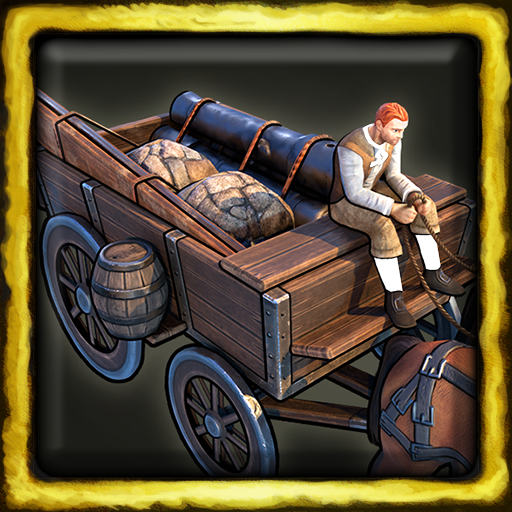 | `deMalteseGunWagon` | 2 | 500 | 20% Siege | — | — | — | Maltese |
| 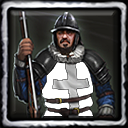 | `deMalteseMusketeer` | 1 | 155 | 20% Hand | 23 Ranged (rng 13); 18.4 Siege (rng 14) | 60 Food, 40 Gold | 2 | Maltese |
| 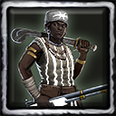 | `deMercAmazon` | 2 | 240 | 10% Hand | 35 Hand; 35 Ranged (rng 20) | 280 Gold | 2 | Argentines, Barbary, Brazil, British, Canadians, Chileans, Columbians, Dutch, Egyptians, Finnish, French, Germans, Haitians, Hausa, Hungarians, Indonesians, Maltese, NapoleonicFrance, Ottomans, Peruvians, Portuguese, RevFrance, Romanians, Russians, SouthAfricans, Spanish, Swedes |
| 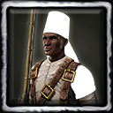 | `deMercAskari` | 2 | 400 | 20% Hand | 40 Siege; 40 Ranged (rng 16) | 230 Gold | 2 | Argentines, Barbary, Brazil, British, Canadians, Chileans, Columbians, Dutch, Egyptians, Ethiopians, Finnish, French, Germans, Haitians, Hausa, Hungarians, Indonesians, Maltese, NapoleonicFrance, Ottomans, Peruvians, Portuguese, RevFrance, Romanians, Russians, SouthAfricans, Spanish, Swedes |
| 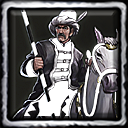 | `deMercBosniak` | 2 | 550 | 20% Ranged | 67.5 Hand (rng 3); 45 Siege | 350 Gold | 3 | Argentines, Barbary, Brazil, British, Canadians, Chileans, Columbians, Dutch, Egyptians, Finnish, French, Germans, Haitians, Hungarians, Indonesians, Italians, Maltese, NapoleonicFrance, Ottomans, Peruvians, Portuguese, RevFrance, Romanians, Russians, SouthAfricans, Spanish, Swedes |
|  | `deMercBrigadier` | 1 | 160 | 40% Hand | 25 Ranged (rng 12); 22 Siege | 100 Gold | 1 | Argentines, Barbary, Brazil, British, Canadians, Chileans, Columbians, Dutch, Egyptians, Finnish, French, Germans, Haitians, Haudenosaunee, Hungarians, Indonesians, Maltese, Mexicans, NapoleonicFrance, Ottomans, Peruvians, Portuguese, RevFrance, Romanians, Russians, SouthAfricans, Spanish, Swedes |
| 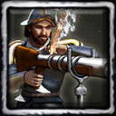 | `deMercCannoneer` | 1 | 130 | 20% Ranged | 28 Siege (rng 18); 20 Hand | 140 Gold | 1 | Argentines, Barbary, Brazil, British, Canadians, Chileans, Columbians, Dutch, Egyptians, Ethiopians, Finnish, French, Germans, Haitians, Hausa, Hungarians, Indonesians, Maltese, NapoleonicFrance, Ottomans, Peruvians, Portuguese, RevFrance, Romanians, Russians, SouthAfricans, Spanish, Swedes |
| 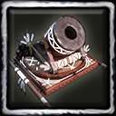 | `deMercCapturedMortar` | 3 | 250 | 75% Ranged | 416.7 Siege (rng 40) | 450 Gold | 6 | Lakota, Mayans |
| 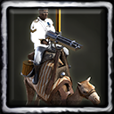 | `deMercGatlingCamel` | 3 | 320 | 30% Ranged | 22 Hand; 14.5 Siege (rng 14) | 450 Gold | 5 | Argentines, Barbary, Brazil, British, Canadians, Chileans, Columbians, Dutch, Egyptians, Ethiopians, Finnish, French, Germans, Haitians, Hausa, Hungarians, Indonesians, Maltese, NapoleonicFrance, Ottomans, Peruvians, Portuguese, RevFrance, Romanians, Russians, SouthAfricans, Spanish, Swedes |
|  | `deMercGrenadier` | 2 | 250 | 30% Hand | 50 Siege (rng 12); 36 Hand | 250 Gold | 2 | Argentines, Barbary, Brazil, British, Canadians, Chileans, Columbians, Dutch, Egyptians, Finnish, French, Germans, Haitians, Hungarians, Indonesians, Italians, Maltese, NapoleonicFrance, Ottomans, Peruvians, Portuguese, RevFrance, Romanians, Russians, SouthAfricans, Spanish, Swedes |
| 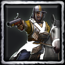 | `deMercHarquebusier` | 2 | 295 | 20% Ranged | 121 Hand; 80 Ranged (rng 6) | 330 Gold | 3 | Argentines, Barbary, Brazil, British, Canadians, Chileans, Columbians, Dutch, Egyptians, Ethiopians, Finnish, French, Germans, Haitians, Haudenosaunee, Hungarians, Indonesians, Maltese, NapoleonicFrance, Ottomans, Peruvians, Portuguese, RevFrance, Romanians, Russians, SouthAfricans, Spanish, Swedes |
| 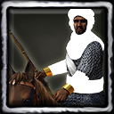 | `deMercKanuri` | 2 | 390 | 30% Ranged | 30 Ranged (rng 12); 15 Hand | 220 Gold | 3 | Argentines, Barbary, Brazil, British, Canadians, Chileans, Columbians, Dutch, Egyptians, Finnish, French, Germans, Haitians, Hausa, Hungarians, Indonesians, Maltese, NapoleonicFrance, Ottomans, Peruvians, Portuguese, RevFrance, Romanians, Russians, SouthAfricans, Spanish, Swedes |
| 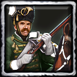 | `deMercMountedRifleman` | 3 | 360 | 25% Ranged | 70 Ranged (rng 15); 45 Hand | 400 Gold | 4 | Argentines, Barbary, Brazil, British, Canadians, Chileans, Columbians, Dutch, Egyptians, Finnish, French, Germans, Haitians, Hungarians, Indonesians, Italians, Maltese, NapoleonicFrance, Ottomans, Peruvians, Portuguese, RevFrance, Romanians, Russians, SouthAfricans, Spanish, Swedes |
| 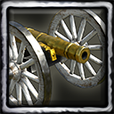 | `deMercNapoleonGun` | 2 | 230 | 50% Ranged | 75 Siege (rng 23) | 450 Gold | 4 | Argentines, BajaCalifornians, Barbary, Brazil, British, Californians, Canadians, CentralAmericans, Chileans, Columbians, Dutch, Egyptians, Finnish, French, Germans, Haitians, Hungarians, Indonesians, Maltese, Mexicans, NapoleonicFrance, Ottomans, Peruvians, Portuguese, RevFrance, RioGrande, Romanians, Russians, SouthAfricans, Spanish, Swedes |
| 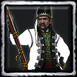 | `deMercPandour` | 2 | 230 | 40% Ranged | 25 Ranged (rng 20); 20 Siege | 185 Gold | 2 | Argentines, Barbary, Brazil, British, Canadians, Chileans, Columbians, Dutch, Egyptians, Finnish, French, Germans, Haitians, Hungarians, Indonesians, Italians, Maltese, NapoleonicFrance, Ottomans, Peruvians, Portuguese, RevFrance, Romanians, Russians, SouthAfricans, Spanish, Swedes |
| 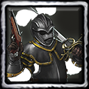 | `deMercPistoleer` | 2 | 560 | 60% Hand | 46 Siege; 45 Ranged (rng 12) | 250 Gold | 4 | Argentines, Barbary, Brazil, British, Canadians, Chileans, Columbians, Dutch, Egyptians, Finnish, French, Germans, Haitians, Hungarians, Indonesians, Italians, Maltese, NapoleonicFrance, Ottomans, Peruvians, Portuguese, RevFrance, Romanians, Russians, SouthAfricans, Spanish, Swedes |
|  | `deMercRoyalHorseman` | 3 | 900 | 30% Ranged | 30 Siege; 30 Hand | 400 Gold | 4 | Argentines, Barbary, Brazil, British, Canadians, Chileans, Columbians, Dutch, Egyptians, Finnish, French, Germans, Haitians, Hungarians, Indonesians, Italians, Maltese, Mexicans, NapoleonicFrance, Ottomans, Peruvians, Portuguese, RevFrance, Romanians, Russians, SouthAfricans, Spanish, Swedes |
|  | `deMercSudaneseRider` | 2 | 1000 | 20% Ranged, 30% Siege | 55 Siege; 32 Hand | 400 Gold | 4 | Argentines, Barbary, Brazil, British, Canadians, Chileans, Columbians, Dutch, Egyptians, Ethiopians, Finnish, French, Germans, Haitians, Hausa, Hungarians, Indonesians, Maltese, NapoleonicFrance, Ottomans, Peruvians, Portuguese, RevFrance, Romanians, Russians, SouthAfricans, Spanish, Swedes |
|  | `deMercZenata` | 2 | 375 | 25% Ranged | 35 Ranged (rng 15); 14 Hand | 250 Gold | 3 | Argentines, Barbary, Brazil, British, Canadians, Chileans, Columbians, Dutch, Egyptians, Finnish, French, Germans, Haitians, Hausa, Hungarians, Indonesians, Italians, Maltese, NapoleonicFrance, Ottomans, Peruvians, Portuguese, RevFrance, Romanians, Russians, SouthAfricans, Spanish, Swedes |
|  | `deMercZouave` | 3 | 360 | 40% Ranged | 38 Ranged (rng 17); 30 Siege | 300 Gold | 2 | Argentines, Barbary, Brazil, British, Canadians, Chileans, Columbians, Dutch, Egyptians, Finnish, French, Germans, Haitians, Hungarians, Indonesians, Italians, Maltese, NapoleonicFrance, Ottomans, Peruvians, Portuguese, RevFrance, Romanians, Russians, SouthAfricans, Spanish, Swedes |
|  | `deMinuteman` | 2 | 200 | 20% Hand | 26 Ranged (rng 12); 13 Hand | 60 Food, 75 Gold | 1 | USA |
|  | `deMXSpanishMusketeer` | 1 | 150 | 20% Hand | 23 Ranged (rng 12); 20 Siege | 75 Food, 25 Gold | 1 | Argentines, BajaCalifornians, Californians, CentralAmericans, Germans, Italians, Mayans, Mexicans, RioGrande, Spanish, Texians |
|  | `deNatAkanMusketeer` | 1 | 170 | 20% Hand | 19 Ranged (rng 12); 16 Siege (rng 6) | 75 Food, 40 Gold | — | Argentines, Aztecs, BajaCalifornians, Barbary, Brazil, British, Californians, Canadians, CentralAmericans, Chileans, Chinese, Columbians, Dutch, Egyptians, Ethiopians, Finnish, French, Germans, Haitians, Haudenosaunee, Hausa, Hungarians, Inca, Indians, Indonesians, Italians, Japanese, Lakota, Maltese, Mayans, Mexicans, NapoleonicFrance, Ottomans, Peruvians, Portuguese, RevFrance, RioGrande, Romanians, Russians, SouthAfricans, Spanish, Swedes, Texians, USA |
|  | `deNatBolasRider` | 1 | 200 | 20% Ranged | 14 Ranged (rng 12); 11 Hand | 90 Food, 90 Wood | — | Argentines, Aztecs, BajaCalifornians, Barbary, Brazil, British, Californians, Canadians, CentralAmericans, Chileans, Chinese, Columbians, Dutch, Egyptians, Ethiopians, Finnish, French, Germans, Haitians, Haudenosaunee, Hausa, Hungarians, Inca, Indians, Indonesians, Italians, Japanese, Lakota, Maltese, Mayans, Mexicans, NapoleonicFrance, Ottomans, Peruvians, Portuguese, RevFrance, RioGrande, Romanians, Russians, SouthAfricans, Spanish, Swedes, Texians, USA |
|  | `deNatBoyar` | 2 | 340 | 20% Ranged | 20 Hand; 16.5 Siege | 130 Food, 90 Gold | — | Argentines, Aztecs, BajaCalifornians, Barbary, Brazil, British, Californians, Canadians, CentralAmericans, Chileans, Chinese, Columbians, Dutch, Egyptians, Ethiopians, Finnish, French, Germans, Haitians, Haudenosaunee, Hausa, Hungarians, Inca, Indians, Indonesians, Italians, Japanese, Lakota, Maltese, Mayans, Mexicans, NapoleonicFrance, Ottomans, Peruvians, Portuguese, RevFrance, RioGrande, Romanians, Russians, SouthAfricans, Spanish, Swedes, Texians, USA |
|  | `deNatBrunswicker` | 2 | 135 | 20% Hand | 21 Siege; 16 Ranged (rng 14) | 70 Food, 50 Gold | — | Argentines, Aztecs, BajaCalifornians, Barbary, Brazil, British, Californians, Canadians, CentralAmericans, Chileans, Chinese, Columbians, Dutch, Egyptians, Ethiopians, Finnish, French, Germans, Haitians, Haudenosaunee, Hausa, Hungarians, Inca, Indians, Indonesians, Italians, Japanese, Lakota, Maltese, Mayans, Mexicans, NapoleonicFrance, Ottomans, Peruvians, Portuguese, RevFrance, RioGrande, Romanians, Russians, SouthAfricans, Spanish, Swedes, Texians, USA |
|  | `deNatCamelRider` | 1 | 300 | 20% Hand | 24 Ranged (rng 15); 22 Hand | 120 Food, 60 Gold | — | Argentines, Aztecs, BajaCalifornians, Barbary, Brazil, British, Californians, Canadians, CentralAmericans, Chileans, Chinese, Columbians, Dutch, Egyptians, Ethiopians, Finnish, French, Germans, Haitians, Haudenosaunee, Hausa, Hungarians, Inca, Indians, Indonesians, Italians, Japanese, Lakota, Maltese, Mayans, Mexicans, NapoleonicFrance, Ottomans, Peruvians, Portuguese, RevFrance, RioGrande, Romanians, Russians, SouthAfricans, Spanish, Swedes, Texians, USA |
|  | `deNatChevauleger` | 2 | 235 | 20% Ranged | 26.5 Hand; 19.5 Ranged (rng 12) | 110 Food, 90 Gold | — | Argentines, Aztecs, BajaCalifornians, Barbary, Brazil, British, Californians, Canadians, CentralAmericans, Chileans, Chinese, Columbians, Dutch, Egyptians, Ethiopians, Finnish, French, Germans, Haitians, Haudenosaunee, Hausa, Hungarians, Inca, Indians, Indonesians, Italians, Japanese, Lakota, Maltese, Mayans, Mexicans, NapoleonicFrance, Ottomans, Peruvians, Portuguese, RevFrance, RioGrande, Romanians, Russians, SouthAfricans, Spanish, Swedes, Texians, USA |
|  | `deNatDrummer` | 1 | 250 | 10% Hand | 20 Ranged (rng 12); 10 Siege (rng 6) | 150 Food, 150 Gold | 1 | Argentines, Aztecs, BajaCalifornians, Barbary, Brazil, British, Californians, Canadians, CentralAmericans, Chileans, Chinese, Columbians, Dutch, Egyptians, Ethiopians, Finnish, French, Germans, Haitians, Haudenosaunee, Hausa, Hungarians, Inca, Indians, Indonesians, Italians, Japanese, Lakota, Maltese, Mayans, Mexicans, NapoleonicFrance, Ottomans, Peruvians, Portuguese, RevFrance, RioGrande, Romanians, Russians, SouthAfricans, Spanish, Swedes, Texians, USA |
|  | `deNatEvzone` | 1 | 180 | 30% Ranged | 12 Siege (rng 6); 11 Ranged (rng 16) | 110 Food, 30 Wood | — | Argentines, Aztecs, BajaCalifornians, Barbary, Brazil, British, Californians, Canadians, CentralAmericans, Chileans, Chinese, Columbians, Dutch, Egyptians, Ethiopians, Finnish, French, Germans, Haitians, Haudenosaunee, Hausa, Hungarians, Inca, Indians, Indonesians, Italians, Japanese, Lakota, Maltese, Mayans, Mexicans, NapoleonicFrance, Ottomans, Peruvians, Portuguese, RevFrance, RioGrande, Romanians, Russians, SouthAfricans, Spanish, Swedes, Texians, USA |
|  | `deNatHolcanJavelineer` | 1 | 185 | 10% Hand | 24 Siege; 10 Hand | 75 Food, 25 Wood | — | Argentines, Aztecs, BajaCalifornians, Barbary, Brazil, British, Californians, Canadians, CentralAmericans, Chileans, Chinese, Columbians, Dutch, Egyptians, Ethiopians, Finnish, French, Germans, Haitians, Haudenosaunee, Hausa, Hungarians, Inca, Indians, Indonesians, Italians, Japanese, Lakota, Maltese, Mayans, Mexicans, NapoleonicFrance, Ottomans, Peruvians, Portuguese, RevFrance, RioGrande, Romanians, Russians, SouthAfricans, Spanish, Swedes, Texians, USA |
|  | `deNatLineInfantry` | 2 | 140 | 10% Ranged | 21 Ranged (rng 13); 17 Siege | 60 Food, 55 Gold | — | Argentines, Aztecs, BajaCalifornians, Barbary, Brazil, British, Californians, Canadians, CentralAmericans, Chileans, Chinese, Columbians, Dutch, Egyptians, Ethiopians, Finnish, French, Germans, Haitians, Haudenosaunee, Hausa, Hungarians, Inca, Indians, Indonesians, Italians, Japanese, Lakota, Maltese, Mayans, Mexicans, NapoleonicFrance, Ottomans, Peruvians, Portuguese, RevFrance, RioGrande, Romanians, Russians, SouthAfricans, Spanish, Swedes, Texians, USA |
|  | `deNatLipkaTatar` | 1 | 140 | 30% Hand | 12.5 Ranged (rng 12); 12.5 Hand | 70 Food, 60 Wood | — | Argentines, Aztecs, BajaCalifornians, Barbary, Brazil, British, Californians, Canadians, CentralAmericans, Chileans, Chinese, Columbians, Dutch, Egyptians, Ethiopians, Finnish, French, Germans, Haitians, Haudenosaunee, Hausa, Hungarians, Inca, Indians, Indonesians, Italians, Japanese, Lakota, Maltese, Mayans, Mexicans, NapoleonicFrance, Ottomans, Peruvians, Portuguese, RevFrance, RioGrande, Romanians, Russians, SouthAfricans, Spanish, Swedes, Texians, USA |
|  | `deNatMercAkanMusketeer` | 1 | 170 | 20% Hand | 19 Ranged (rng 12); 16 Siege (rng 6) | 75 Food, 40 Gold | — | Brazil, British, Dutch, French, Haitians, Hausa, Indonesians, Italians, Portuguese |
|  | `deNatMercApacheCavalry` | 1 | 200 | 30% Ranged | 22 Ranged (rng 12); 11 Hand | 90 Food, 90 Gold | — | BajaCalifornians, Californians, CentralAmericans, Mexicans, RioGrande, Texians, USA |
|  | `deNatMercBolasRider` | 1 | 200 | 20% Ranged | 14 Ranged (rng 12); 11 Hand | 90 Food, 90 Wood | — | Argentines, Chileans, Inca, Spanish |
|  | `deNatMercBoyar` | 2 | 340 | 20% Ranged | 20 Hand; 16.5 Siege | 130 Food, 90 Gold | — | Maltese, Ottomans, Romanians, Russians |
|  | `deNatMercBrunswicker` | 2 | 135 | 20% Hand | 21 Siege; 16 Ranged (rng 14) | 70 Food, 50 Gold | — | Germans |
|  | `deNatMercCamelRider` | 1 | 300 | 20% Hand | 24 Ranged (rng 15); 22 Hand | 120 Food, 60 Gold | — | Barbary, Egyptians, Ethiopians, Hausa, Italians, Maltese, Ottomans, Portuguese |
|  | `deNatMercChevauleger` | 2 | 235 | 20% Ranged | 26.5 Hand; 19.5 Ranged (rng 12) | 110 Food, 90 Gold | — | Finnish, NapoleonicFrance, RevFrance, Swedes |
|  | `deNatMercDrummer` | 1 | 250 | 10% Hand | 20 Ranged (rng 12); 10 Siege (rng 6) | 150 Food, 150 Gold | 1 | British, Canadians, French |
|  | `deNatMercEvzone` | 1 | 180 | 30% Ranged | 12 Siege (rng 6); 11 Ranged (rng 16) | 110 Food, 30 Wood | — | Italians, Maltese, Ottomans, Romanians |
|  | `deNatMercHolcanJavelineer` | 1 | 185 | 10% Hand | 24 Siege; 10 Hand | 75 Food, 25 Wood | — | Aztecs, Inca, Spanish |
|  | `deNatMercLenapeRifleman` | 1 | 200 | 20% Hand | 30 Ranged (rng 14); 25 Siege | 90 Food, 30 Gold | — | British, Canadians, French, Haudenosaunee |
|  | `deNatMercLineInfantry` | 2 | 140 | 10% Ranged | 21 Ranged (rng 13); 17 Siege | 60 Food, 55 Gold | — | Dutch, Germans, Hungarians, Indonesians, SouthAfricans |
|  | `deNatMercMapucheClubman` | 1 | 200 | 20% Hand | 26 Siege; 24 Hand | 100 Food, 65 Wood | — | Inca |
|  | `deNatMercMountainTrooper` | 1 | 120 | 30% Ranged | 15 Ranged (rng 20); 12 Siege (rng 6) | 50 Food, 65 Wood | — | Finnish, NapoleonicFrance, RevFrance, Swedes |
|  | `deNatMercMountedInfantryRider` | 1 | 220 | 15% Ranged | 14 Ranged (rng 12); 9 Siege | 120 Food, 40 Gold | — | Argentines, Chileans, Columbians, Dutch, Germans, Hungarians, Indonesians, Italians, Peruvians, SouthAfricans, Spanish |
|  | `deNatMercNavajoRifleman` | 1 | 200 | 10% Ranged | 11 Ranged (rng 16); 10 Siege (rng 6) | 60 Food, 40 Wood | — | BajaCalifornians, Californians, CentralAmericans, Mexicans, RioGrande, Texians, USA |
|  | `deNatMercNorthernMusketeer` | 2 | 120 | 20% Hand | 22.5 Ranged (rng 14); 19.5 Siege | 110 Food | — | Finnish, Russians, Swedes |
|  | `deNatMercQizilbash` | 1 | 230 | 20% Ranged | 18 Hand (rng 3.8); 12.5 Ranged (rng 12) | 120 Food, 75 Wood | — | Barbary, Egyptians, Ottomans |
|  | `deNatMercRoyalArquebusier` | 1 | 150 | 10% Hand | 12 Ranged (rng 15); 9 Siege (rng 6) | 70 Food, 30 Wood | — | Finnish, Russians, Swedes |
|  | `deNatMercRoyalDragoon` | 2 | 190 | 20% Ranged | 22 Hand; 18 Ranged (rng 16) | 100 Food, 100 Gold | — | French, Haitians, Italians |
|  | `deNatMercRoyalHunter` | 1 | 150 | 30% Ranged | 13 Ranged (rng 19); 10 Siege (rng 6) | 140 Food | — | Russians |
|  | `deNatMercRoyalMusketeer` | 1 | 160 | 40% Hand | 44 Ranged (rng 12); 20 Siege (rng 14) | 75 Food, 40 Gold | — | Argentines, British, Chileans, Columbians, Dutch, French, Haitians, Italians, Maltese, Peruvians, Spanish, Swedes |
|  | `deNatMercSaxonCuirassier` | 2 | 425 | 20% Ranged | 25 Siege; 25 Hand | 150 Food, 150 Wood | — | Dutch, Germans, Indonesians, SouthAfricans |
|  | `deNatMercSharktoothBowman` | 1 | 115 | 20% Ranged | 16 Ranged (rng 16); 10 Siege (rng 10) | 50 Food, 50 Wood | — | USA |
|  | `deNatMercShockRider` | 1 | 220 | 10% Ranged, 10% Hand | 37.5 Hand (rng 2); 19 Siege | 110 Food, 90 Wood | — | Finnish, Swedes |
|  | `deNatMercSomaliDarood` | 1 | 140 | 30% Ranged, 30% Siege | 20 Siege (rng 6); 11 Ranged (rng 25) | 60 Food, 60 Wood | — | Ethiopians |
|  | `deNatMercSomaliJavelineer` | 1 | 120 | 20% Hand | 14 Ranged (rng 14); 12 Siege | 40 Food, 60 Wood | — | Ethiopians |
|  | `deNatMercSudaneseDervish` | 1 | 110 | 15% Ranged | 9 Hand; 8 Siege | 50 Food, 50 Wood | — | Egyptians, Ethiopians, Hausa, Ottomans |
|  | `deNatMercTatarArcher` | 1 | 140 | 20% Hand | 7 Siege; 7 Hand | 90 Food, 55 Wood | — | Ottomans |
|  | `deNatMercTotenkopf` | 1 | 180 | 30% Ranged | 54 Hand; 20 Siege | 70 Food, 90 Gold | — | British, Canadians, Maltese |
|  | `deNatMercTrabant` | 1 | 180 | 20% Siege | 30 Ranged (rng 12); 22 Hand | 60 Food, 70 Gold | — | Brazil, Germans, Portuguese |
|  | `deNatMercWingedHussar` | 2 | 395 | 20% Ranged | 41.2 Siege (rng 2); 27.5 Hand (rng 3.8) | 200 Food, 100 Gold | — | Germans |
|  | `deNatMercYorubaLegionary` | 1 | 220 | 25% Ranged | 26 Ranged (rng 16); 16 Siege | 90 Food, 90 Wood | — | Hausa |
|  | `deNatMercYorubaRider` | 1 | 200 | 55% Ranged, 55% Hand | 35 Hand; 15 Siege | 90 Food, 90 Gold | — | Hausa |
|  | `deNatMountainTrooper` | 1 | 120 | 30% Ranged | 15 Ranged (rng 20); 12 Siege (rng 6) | 50 Food, 65 Wood | — | Argentines, Aztecs, BajaCalifornians, Barbary, Brazil, British, Californians, Canadians, CentralAmericans, Chileans, Chinese, Columbians, Dutch, Egyptians, Ethiopians, Finnish, French, Germans, Haitians, Haudenosaunee, Hausa, Hungarians, Inca, Indians, Indonesians, Italians, Japanese, Lakota, Maltese, Mayans, Mexicans, NapoleonicFrance, Ottomans, Peruvians, Portuguese, RevFrance, RioGrande, Romanians, Russians, SouthAfricans, Spanish, Swedes, Texians, USA |
|  | `deNatMountedInfantryRider` | 1 | 220 | 15% Ranged | 14 Ranged (rng 12); 9 Siege | 120 Food, 40 Gold | — | Argentines, Aztecs, BajaCalifornians, Barbary, Brazil, British, Californians, Canadians, CentralAmericans, Chileans, Chinese, Columbians, Dutch, Egyptians, Ethiopians, Finnish, French, Germans, Haitians, Haudenosaunee, Hausa, Hungarians, Inca, Indians, Indonesians, Italians, Japanese, Lakota, Maltese, Mayans, Mexicans, NapoleonicFrance, Ottomans, Peruvians, Portuguese, RevFrance, RioGrande, Romanians, Russians, SouthAfricans, Spanish, Swedes, Texians, USA |
|  | `deNatNorthernMusketeer` | 2 | 120 | 20% Hand | 22.5 Ranged (rng 14); 19.5 Siege | 110 Food | — | Argentines, Aztecs, BajaCalifornians, Barbary, Brazil, British, Californians, Canadians, CentralAmericans, Chileans, Chinese, Columbians, Dutch, Egyptians, Ethiopians, Finnish, French, Germans, Haitians, Haudenosaunee, Hausa, Hungarians, Inca, Indians, Indonesians, Italians, Japanese, Lakota, Maltese, Mayans, Mexicans, NapoleonicFrance, Ottomans, Peruvians, Portuguese, RevFrance, RioGrande, Romanians, Russians, SouthAfricans, Spanish, Swedes, Texians, USA |
|  | `deNatQizilbash` | 1 | 230 | 20% Ranged | 18 Hand (rng 3.8); 12.5 Ranged (rng 12) | 120 Food, 75 Wood | — | Argentines, Aztecs, BajaCalifornians, Barbary, Brazil, British, Californians, Canadians, CentralAmericans, Chileans, Chinese, Columbians, Dutch, Egyptians, Ethiopians, Finnish, French, Germans, Haitians, Haudenosaunee, Hausa, Hungarians, Inca, Indians, Indonesians, Italians, Japanese, Lakota, Maltese, Mayans, Mexicans, NapoleonicFrance, Ottomans, Peruvians, Portuguese, RevFrance, RioGrande, Romanians, Russians, SouthAfricans, Spanish, Swedes, Texians, USA |
|  | `deNatRoyalArquebusier` | 1 | 150 | 10% Hand | 12 Ranged (rng 15); 9 Siege (rng 6) | 70 Food, 30 Wood | — | Argentines, Aztecs, BajaCalifornians, Barbary, Brazil, British, Californians, Canadians, CentralAmericans, Chileans, Chinese, Columbians, Dutch, Egyptians, Ethiopians, Finnish, French, Germans, Haitians, Haudenosaunee, Hausa, Hungarians, Inca, Indians, Indonesians, Italians, Japanese, Lakota, Maltese, Mayans, Mexicans, NapoleonicFrance, Ottomans, Peruvians, Portuguese, RevFrance, RioGrande, Romanians, Russians, SouthAfricans, Spanish, Swedes, Texians, USA |
|  | `deNatRoyalDragoon` | 2 | 190 | 20% Ranged | 22 Hand; 18 Ranged (rng 16) | 100 Food, 100 Gold | — | Argentines, Aztecs, BajaCalifornians, Barbary, Brazil, British, Californians, Canadians, CentralAmericans, Chileans, Chinese, Columbians, Dutch, Egyptians, Ethiopians, Finnish, French, Germans, Haitians, Haudenosaunee, Hausa, Hungarians, Inca, Indians, Indonesians, Italians, Japanese, Lakota, Maltese, Mayans, Mexicans, NapoleonicFrance, Ottomans, Peruvians, Portuguese, RevFrance, RioGrande, Romanians, Russians, SouthAfricans, Spanish, Swedes, Texians, USA |
|  | `deNatRoyalHorsemanBourbonProxy` | 3 | 750 | 20% Hand | 40 Siege; 40 Ranged (rng 16) | 400 Gold | 4 | Argentines, Aztecs, BajaCalifornians, Barbary, Brazil, British, Californians, Canadians, CentralAmericans, Chileans, Chinese, Columbians, Dutch, Egyptians, Ethiopians, Finnish, French, Germans, Haitians, Haudenosaunee, Hausa, Hungarians, Inca, Indians, Indonesians, Italians, Japanese, Lakota, Maltese, Mayans, Mexicans, NapoleonicFrance, Ottomans, Peruvians, Portuguese, RevFrance, RioGrande, Romanians, Russians, SouthAfricans, Spanish, Swedes, Texians, USA |
|  | `deNatRoyalHunter` | 1 | 150 | 30% Ranged | 14 Ranged (rng 19); 10 Siege (rng 6) | 140 Food | — | Argentines, Aztecs, BajaCalifornians, Barbary, Brazil, British, Californians, Canadians, CentralAmericans, Chileans, Chinese, Columbians, Dutch, Egyptians, Ethiopians, Finnish, French, Germans, Haitians, Haudenosaunee, Hausa, Hungarians, Inca, Indians, Indonesians, Italians, Japanese, Lakota, Maltese, Mayans, Mexicans, NapoleonicFrance, Ottomans, Peruvians, Portuguese, RevFrance, RioGrande, Romanians, Russians, SouthAfricans, Spanish, Swedes, Texians, USA |
|  | `deNatRoyalMusketeer` | 1 | 160 | 40% Hand | 44 Ranged (rng 12); 20 Siege (rng 14) | 75 Food, 40 Gold | — | Argentines, Aztecs, BajaCalifornians, Barbary, Brazil, British, Californians, Canadians, CentralAmericans, Chileans, Chinese, Columbians, Dutch, Egyptians, Ethiopians, Finnish, French, Germans, Haitians, Haudenosaunee, Hausa, Hungarians, Inca, Indians, Indonesians, Italians, Japanese, Lakota, Maltese, Mayans, Mexicans, NapoleonicFrance, Ottomans, Peruvians, Portuguese, RevFrance, RioGrande, Romanians, Russians, SouthAfricans, Spanish, Swedes, Texians, USA |
|  | `deNatSaxonCuirassier` | 2 | 425 | 20% Ranged | 25 Siege; 25 Hand | 150 Food, 150 Wood | — | Argentines, Aztecs, BajaCalifornians, Barbary, Brazil, British, Californians, Canadians, CentralAmericans, Chileans, Chinese, Columbians, Dutch, Egyptians, Ethiopians, Finnish, French, Germans, Haitians, Haudenosaunee, Hausa, Hungarians, Inca, Indians, Indonesians, Italians, Japanese, Lakota, Maltese, Mayans, Mexicans, NapoleonicFrance, Ottomans, Peruvians, Portuguese, RevFrance, RioGrande, Romanians, Russians, SouthAfricans, Spanish, Swedes, Texians, USA |
|  | `deNatShockRider` | 1 | 220 | 10% Ranged, 10% Hand | 37.5 Hand (rng 2); 19 Siege | 110 Food, 90 Wood | — | Argentines, Aztecs, BajaCalifornians, Barbary, Brazil, British, Californians, Canadians, CentralAmericans, Chileans, Chinese, Columbians, Dutch, Egyptians, Ethiopians, Finnish, French, Germans, Haitians, Haudenosaunee, Hausa, Hungarians, Inca, Indians, Indonesians, Italians, Japanese, Lakota, Maltese, Mayans, Mexicans, NapoleonicFrance, Ottomans, Peruvians, Portuguese, RevFrance, RioGrande, Romanians, Russians, SouthAfricans, Spanish, Swedes, Texians, USA |
|  | `deNatSomaliAskariProxy` | 2 | 400 | 20% Hand | 40 Siege; 40 Ranged (rng 16) | 250 Gold | 2 | Argentines, Aztecs, BajaCalifornians, Barbary, Brazil, British, Californians, Canadians, CentralAmericans, Chileans, Chinese, Columbians, Dutch, Egyptians, Ethiopians, Finnish, French, Germans, Haitians, Haudenosaunee, Hausa, Hungarians, Inca, Indians, Indonesians, Italians, Japanese, Lakota, Maltese, Mayans, Mexicans, NapoleonicFrance, Ottomans, Peruvians, Portuguese, RevFrance, RioGrande, Romanians, Russians, SouthAfricans, Spanish, Swedes, Texians, USA |
|  | `deNatSomaliDarood` | 1 | 140 | 30% Ranged, 30% Siege | 20 Siege (rng 6); 11 Ranged (rng 25) | 60 Food, 60 Wood | — | Argentines, Aztecs, BajaCalifornians, Barbary, Brazil, British, Californians, Canadians, CentralAmericans, Chileans, Chinese, Columbians, Dutch, Egyptians, Ethiopians, Finnish, French, Germans, Haitians, Haudenosaunee, Hausa, Hungarians, Inca, Indians, Indonesians, Italians, Japanese, Lakota, Maltese, Mayans, Mexicans, NapoleonicFrance, Ottomans, Peruvians, Portuguese, RevFrance, RioGrande, Romanians, Russians, SouthAfricans, Spanish, Swedes, Texians, USA |
|  | `deNatSomaliJavelineer` | 1 | 120 | 20% Hand | 14 Ranged (rng 14); 12 Siege | 40 Food, 60 Wood | — | Argentines, Aztecs, BajaCalifornians, Barbary, Brazil, British, Californians, Canadians, CentralAmericans, Chileans, Chinese, Columbians, Dutch, Egyptians, Ethiopians, Finnish, French, Germans, Haitians, Haudenosaunee, Hausa, Hungarians, Inca, Indians, Indonesians, Italians, Japanese, Lakota, Maltese, Mayans, Mexicans, NapoleonicFrance, Ottomans, Peruvians, Portuguese, RevFrance, RioGrande, Romanians, Russians, SouthAfricans, Spanish, Swedes, Texians, USA |
|  | `deNatSPCLenapeRifleman` | 1 | 200 | 20% Hand | 30 Ranged (rng 14); 25 Siege | 90 Food, 30 Gold | — | Argentines, Aztecs, BajaCalifornians, Barbary, Brazil, British, Californians, Canadians, CentralAmericans, Chileans, Chinese, Columbians, Dutch, Egyptians, Ethiopians, Finnish, French, Germans, Haitians, Haudenosaunee, Hausa, Hungarians, Inca, Indians, Indonesians, Italians, Japanese, Lakota, Maltese, Mayans, Mexicans, NapoleonicFrance, Ottomans, Peruvians, Portuguese, RevFrance, RioGrande, Romanians, Russians, SouthAfricans, Spanish, Swedes, Texians, USA |
|  | `deNatSudaneseAskariProxy` | 2 | 400 | 20% Hand | 40 Siege; 40 Ranged (rng 16) | 250 Gold | 2 | Argentines, Aztecs, BajaCalifornians, Barbary, Brazil, British, Californians, Canadians, CentralAmericans, Chileans, Chinese, Columbians, Dutch, Egyptians, Ethiopians, Finnish, French, Germans, Haitians, Haudenosaunee, Hausa, Hungarians, Inca, Indians, Indonesians, Italians, Japanese, Lakota, Maltese, Mayans, Mexicans, NapoleonicFrance, Ottomans, Peruvians, Portuguese, RevFrance, RioGrande, Romanians, Russians, SouthAfricans, Spanish, Swedes, Texians, USA |
|  | `deNatSudaneseDervish` | 1 | 110 | 15% Ranged | 9 Hand; 8 Siege | 50 Food, 50 Wood | — | Argentines, Aztecs, BajaCalifornians, Barbary, Brazil, British, Californians, Canadians, CentralAmericans, Chileans, Chinese, Columbians, Dutch, Egyptians, Ethiopians, Finnish, French, Germans, Haitians, Haudenosaunee, Hausa, Hungarians, Inca, Indians, Indonesians, Italians, Japanese, Lakota, Maltese, Mayans, Mexicans, NapoleonicFrance, Ottomans, Peruvians, Portuguese, RevFrance, RioGrande, Romanians, Russians, SouthAfricans, Spanish, Swedes, Texians, USA |
|  | `deNatSudaneseSennarProxy` | 2 | 1200 | 20% Ranged, 40% Siege | 32 Siege; 32 Hand | 400 Gold | 4 | Argentines, Aztecs, BajaCalifornians, Barbary, Brazil, British, Californians, Canadians, CentralAmericans, Chileans, Chinese, Columbians, Dutch, Egyptians, Ethiopians, Finnish, French, Germans, Haitians, Haudenosaunee, Hausa, Hungarians, Inca, Indians, Indonesians, Italians, Japanese, Lakota, Maltese, Mayans, Mexicans, NapoleonicFrance, Ottomans, Peruvians, Portuguese, RevFrance, RioGrande, Romanians, Russians, SouthAfricans, Spanish, Swedes, Texians, USA |
|  | `deNatTatarArcher` | 1 | 140 | 20% Hand | 7 Siege; 7 Hand | 90 Food, 55 Wood | — | Argentines, Aztecs, BajaCalifornians, Barbary, Brazil, British, Californians, Canadians, CentralAmericans, Chileans, Chinese, Columbians, Dutch, Egyptians, Ethiopians, Finnish, French, Germans, Haitians, Haudenosaunee, Hausa, Hungarians, Inca, Indians, Indonesians, Italians, Japanese, Lakota, Maltese, Mayans, Mexicans, NapoleonicFrance, Ottomans, Peruvians, Portuguese, RevFrance, RioGrande, Romanians, Russians, SouthAfricans, Spanish, Swedes, Texians, USA |
|  | `deNatTotenkopf` | 1 | 180 | 30% Ranged | 54 Hand; 20 Siege | 70 Food, 90 Gold | — | Argentines, Aztecs, BajaCalifornians, Barbary, Brazil, British, Californians, Canadians, CentralAmericans, Chileans, Chinese, Columbians, Dutch, Egyptians, Ethiopians, Finnish, French, Germans, Haitians, Haudenosaunee, Hausa, Hungarians, Inca, Indians, Indonesians, Italians, Japanese, Lakota, Maltese, Mayans, Mexicans, NapoleonicFrance, Ottomans, Peruvians, Portuguese, RevFrance, RioGrande, Romanians, Russians, SouthAfricans, Spanish, Swedes, Texians, USA |
|  | `deNatTrabant` | 1 | 180 | 20% Siege | 30 Ranged (rng 12); 22 Hand | 60 Food, 70 Gold | — | Argentines, Aztecs, BajaCalifornians, Barbary, Brazil, British, Californians, Canadians, CentralAmericans, Chileans, Chinese, Columbians, Dutch, Egyptians, Ethiopians, Finnish, French, Germans, Haitians, Haudenosaunee, Hausa, Hungarians, Inca, Indians, Indonesians, Italians, Japanese, Lakota, Maltese, Mayans, Mexicans, NapoleonicFrance, Ottomans, Peruvians, Portuguese, RevFrance, RioGrande, Romanians, Russians, SouthAfricans, Spanish, Swedes, Texians, USA |
|  | `deNatWingedHussar` | 2 | 395 | 20% Ranged | 41.2 Siege (rng 2); 27.5 Hand (rng 3.8) | 200 Food, 100 Gold | — | Argentines, Aztecs, BajaCalifornians, Barbary, Brazil, British, Californians, Canadians, CentralAmericans, Chileans, Chinese, Columbians, Dutch, Egyptians, Ethiopians, Finnish, French, Germans, Haitians, Haudenosaunee, Hausa, Hungarians, Inca, Indians, Indonesians, Italians, Japanese, Lakota, Maltese, Mayans, Mexicans, NapoleonicFrance, Ottomans, Peruvians, Portuguese, RevFrance, RioGrande, Romanians, Russians, SouthAfricans, Spanish, Swedes, Texians, USA |
|  | `deNatYorubaLegionary` | 1 | 220 | 25% Ranged | 26 Ranged (rng 16); 16 Siege | 90 Food, 90 Wood | — | Argentines, Aztecs, BajaCalifornians, Barbary, Brazil, British, Californians, Canadians, CentralAmericans, Chileans, Chinese, Columbians, Dutch, Egyptians, Ethiopians, Finnish, French, Germans, Haitians, Haudenosaunee, Hausa, Hungarians, Inca, Indians, Indonesians, Italians, Japanese, Lakota, Maltese, Mayans, Mexicans, NapoleonicFrance, Ottomans, Peruvians, Portuguese, RevFrance, RioGrande, Romanians, Russians, SouthAfricans, Spanish, Swedes, Texians, USA |
|  | `deNatYorubaRider` | 1 | 200 | 55% Ranged, 55% Hand | 35 Hand; 15 Siege | 90 Food, 90 Gold | — | Argentines, Aztecs, BajaCalifornians, Barbary, Brazil, British, Californians, Canadians, CentralAmericans, Chileans, Chinese, Columbians, Dutch, Egyptians, Ethiopians, Finnish, French, Germans, Haitians, Haudenosaunee, Hausa, Hungarians, Inca, Indians, Indonesians, Italians, Japanese, Lakota, Maltese, Mayans, Mexicans, NapoleonicFrance, Ottomans, Peruvians, Portuguese, RevFrance, RioGrande, Romanians, Russians, SouthAfricans, Spanish, Swedes, Texians, USA |
|  | `deNeftenya` | 2 | 140 | 30% Ranged | 15 Ranged (rng 20); 12 Siege | 65 Food, 70 Gold | 1 | Ethiopians |
|  | `deNizam` | 3 | 215 | 20% Siege | 25 Siege; 20 Ranged (rng 12) | 60 Food, 70 Gold | 1 | Egyptians, Ottomans |
|  | `deNMPandour` | 1 | 120 | 30% Ranged | 16 Hand; 13.5 Ranged (rng 18) | 120 XP | 1 | Argentines, Brazil, Finnish, Italians, Russians |
|  | `deNMPapalBombard` | 3 | 600 | 75% Ranged | 430 Siege (rng 28) | 800 XP | 8 | Italians |
|  | `deNMPapalElmetto` | 2 | 700 | 30% Ranged | 60 Hand (rng 4); 30 Siege | 300 XP | 3 | Argentines, Brazil, Italians |
|  | `deNMPapalZouave` | 3 | 300 | 40% Ranged | 64 Ranged (rng 25); 20 Hand | 225 XP | 2 | Argentines, Brazil, Italians |
|  | `deOrdenanca` | 1 | 100 | 20% Ranged | 16 Ranged (rng 16); 8 Siege | 35 Food, 35 Wood | 1 | Brazil, French, Haitians, Maltese, NapoleonicFrance, Portuguese, RevFrance, Romanians |
|  | `deOromoWarrior` | 2 | 350 | 20% Ranged | 34 Ranged (rng 12); 30 Hand | 120 Food, 120 Gold | 2 | Ethiopians |
|  | `deOutlawDesertArcher` | 1 | 100 | 30% Ranged | 20 Ranged (rng 22); 12 Siege (rng 12) | 30 Food, 75 Gold | 3 | Argentines, Barbary, Brazil, British, Canadians, Chileans, Columbians, Dutch, Egyptians, Ethiopians, Finnish, French, Germans, Haitians, Hausa, Hungarians, Indonesians, Maltese, NapoleonicFrance, Ottomans, Peruvians, Portuguese, RevFrance, Romanians, Russians, SouthAfricans, Spanish, Swedes |
|  | `deOutlawDesertRaider` | 1 | 280 | 20% Ranged | 26 Siege | 50 Food, 130 Gold | 3 | Argentines, Barbary, Brazil, British, Canadians, Chileans, Columbians, Dutch, Egyptians, Ethiopians, Finnish, French, Germans, Haitians, Hausa, Hungarians, Indonesians, Maltese, NapoleonicFrance, Ottomans, Peruvians, Portuguese, RevFrance, Romanians, Russians, SouthAfricans, Spanish, Swedes |
|  | `deOutlawDesertWarrior` | 1 | 140 | 20% Hand | 24 Siege; 14 Ranged (rng 12) | 30 Food, 75 Gold | 3 | Argentines, Barbary, Brazil, British, Canadians, Chileans, Columbians, Dutch, Egyptians, Ethiopians, Finnish, French, Germans, Haitians, Hausa, Hungarians, Indonesians, Maltese, NapoleonicFrance, Ottomans, Peruvians, Portuguese, RevFrance, Romanians, Russians, SouthAfricans, Spanish, Swedes |
|  | `dePapalGuard` | 1 | 200 | 20% Ranged | 26 Hand (rng 12); 17 Siege | 120 XP | 1 | Argentines, Brazil, Italians |
|  | `dePavisier` | 1 | 115 | 20% Ranged | 16 Siege (rng 18); 16 Ranged (rng 16) | 35 Food, 50 Wood | 1 | Italians |
|  | `dePrince` | 0 | 400 | 10% Ranged | 30 Ranged (rng 16); 12 Siege | 100 Influence | — | Ethiopians |
|  | `deQuakerGun` | 2 | 200 | 75% Ranged | 500 Siege (rng 40) | 100 Wood | 1 | BajaCalifornians, British, Californians, CentralAmericans, Dutch, French, Italians, Mexicans, RioGrande, Swedes, USA |
|  | `deRaider` | 1 | 180 | 30% Ranged | 26 Siege; 22 Hand | 100 Food, 45 Gold | 1 | Hausa |
|  | `deRanger` | 1 | 95 | 35% Ranged | 19 Ranged (rng 18); 13 Siege | 60 Food, 60 Gold | 1 | British, Canadians |
|  | `deRegular` | 1 | 150 | 20% Hand | 25 Ranged (rng 14); 22 Siege | 55 Food, 50 Gold | 1 | BajaCalifornians, British, Californians, CentralAmericans, Dutch, French, Italians, Mexicans, RioGrande, Swedes, Texians, USA |
|  | `deREVBarbaryWarrior` | 3 | 200 | 40% Hand | 16 Hand; 13 Siege (rng 8) | 100 Food | 1 | Barbary, Italians, Maltese, Ottomans, Portuguese |
|  | `deREVCalifornio` | 1 | 180 | 20% Ranged | 20 Ranged (rng 12); 15 Hand | 120 Food | 1 | BajaCalifornians, Californians, CentralAmericans, Mexicans, RioGrande |
|  | `deREVCetbang` | 1 | 150 | 75% Ranged | 55 Siege (rng 26) | 100 Wood, 200 Gold | 2 | Dutch, Indonesians, Portuguese |
|  | `deREVCruzobInfantry` | 4 | 240 | 30% Hand | 34 Ranged (rng 16); 32 Siege | 80 Food, 35 Gold | 1 | BajaCalifornians, Californians, CentralAmericans, Mayans, Mexicans, RioGrande |
|  | `deREVGaucho` | 1 | 225 | 30% Ranged | 16 Ranged (rng 12); 12 Siege | 120 Gold | 7 | Argentines, Germans, Italians, Spanish |
|  | `deREVGranadero` | 1 | 250 | 30% Ranged | 32 Siege (rng 10); 9 Hand | 150 Food | 2 | Argentines, Germans, Italians, Spanish |
|  | `deREVJagunco` | 1 | 250 | 30% Hand | 18 Ranged (rng 12); 13 Siege | 120 Gold | 1 | Brazil, Dutch, Italians, Portuguese |
|  | `deREVJavaSpearman` | 3 | 200 | 30% Ranged | 50 Siege; 13 Hand | 80 Food | 1 | Dutch, Indonesians, Portuguese |
|  | `deREVLlanero` | 1 | 250 | 30% Ranged | 14 Hand; 13 Siege (rng 6) | 120 Gold | 1 | Columbians, Germans, Portuguese, Spanish |
|  | `deREVMancoInca` | 0 | 500 | 30% Hand | 250 Siege (rng 16); 46 Ranged (rng 24) | 200 Gold | — | Peruvians, Portuguese, Spanish |
|  | `deRevolutionaryScout` | 2 | 190 | 10% Ranged | 20 Hand; 10 Siege | 100 Wood | — | RevFrance |
|  | `deREVUSVolunteer` | 3 | 140 | 50% Ranged | 30 Ranged (rng 24); 15 Siege | 40 Food, 75 Gold | 1 | British, Dutch, French, Italians, Swedes |
|  | `deREVVaquero` | 1 | 180 | 40% Ranged, 20% Siege | 11 Siege; 7 Hand | 100 Food, 60 Gold | 1 | Mexicans, Spanish |
|  | `deRifleman` | 2 | 95 | 40% Ranged | 15 Ranged (rng 21); 12 Siege | 40 Food, 75 Gold | 1 | BajaCalifornians, Californians, CentralAmericans, Mexicans, RioGrande, Texians, USA |
|  | `deRussianHalberdier` | 1 | 162 | 20% Hand | 30 Siege; 22 Hand | 50 Food, 70 Gold | 1 | Russians |
|  | `deRussianMusketeer` | 1 | 150 | 20% Hand | 23 Ranged (rng 12); 20 Siege | 75 Food, 25 Gold | 1 | Russians |
|  | `deSebastopolMortar` | 3 | 475 | 75% Ranged | 400 Siege (rng 28) | 1000 Influence | 8 | Ethiopians |
|  | `deShotelWarrior` | 1 | 160 | 10% Ranged | 13 Hand; 11 Siege | 55 Food, 50 Gold | 1 | Brazil, Ethiopians, Portuguese |
|  | `deSlinger` | 2 | 120 | 30% Ranged | 37 Siege (rng 14); 8 Hand | 30 Wood, 90 Gold | 2 | Inca, Peruvians, Portuguese, Spanish |
|  | `deSoldado` | 1 | 300 | 25% Hand | 36 Ranged (rng 12); 32 Siege (rng 9) | 90 Food, 80 Gold | 2 | BajaCalifornians, Californians, CentralAmericans, Mayans, Mexicans, RioGrande, Spanish, Texians |
|  | `deSpearmanLevy` | 0 | 120 | 10% Hand | 7 Hand; 6 Siege | 65 Influence | 1 | Ethiopians, Hausa |
|  | `deSpyOttoman` | 1 | 150 | 20% Ranged | 20 Hand (rng 12); 10 Siege | 25 Food, 110 Gold | 1 | Barbary, Egyptians, Ottomans |
|  | `deStealthPetard` | 2 | 225 | 20% Hand | 2000 Siege; 10 Hand | 50 Food, 100 Wood | 1 | BajaCalifornians, British, Californians, CentralAmericans, Dutch, French, Italians, Mayans, Mexicans, RioGrande, Swedes |
|  | `deTank` | 1 | 3500 | 50% Ranged, 50% Hand, 50% Siege | 100 Siege (rng 18) | 1500 Wood, 1500 Gold | — | Argentines, Barbary, Brazil, Chileans, Columbians, Egyptians, Hungarians, Italians, Mexicans, NapoleonicFrance, Ottomans, Peruvians, Portuguese, RevFrance, Romanians, Spanish |
|  | `deTotenkopf` | 1 | 180 | 30% Ranged | 54 Hand; 20 Siege | 70 Food, 90 Gold | 1 | Germans |
|  | `deUnknownNatEagleWarrior` | 1 | 110 | 30% Ranged | 11 Ranged (rng 14); 10 Siege | 60 Food, 40 Wood | — | Argentines, Aztecs, BajaCalifornians, Barbary, Brazil, British, Californians, Canadians, CentralAmericans, Chileans, Chinese, Columbians, Dutch, Egyptians, Ethiopians, Finnish, French, Germans, Haitians, Haudenosaunee, Hausa, Hungarians, Inca, Indians, Indonesians, Italians, Japanese, Lakota, Maltese, Mayans, Mexicans, NapoleonicFrance, Ottomans, Peruvians, Portuguese, RevFrance, RioGrande, Romanians, Russians, SouthAfricans, Spanish, Swedes, Texians, USA |
|  | `deUnknownNatJaguarWarrior` | 1 | 230 | 10% Hand | 30 Siege; 12 Hand | 40 Food, 60 Wood | — | Argentines, Aztecs, BajaCalifornians, Barbary, Brazil, British, Californians, Canadians, CentralAmericans, Chileans, Chinese, Columbians, Dutch, Egyptians, Ethiopians, Finnish, French, Germans, Haitians, Haudenosaunee, Hausa, Hungarians, Inca, Indians, Indonesians, Italians, Japanese, Lakota, Maltese, Mayans, Mexicans, NapoleonicFrance, Ottomans, Peruvians, Portuguese, RevFrance, RioGrande, Romanians, Russians, SouthAfricans, Spanish, Swedes, Texians, USA |
|  | `deUSCavalry` | 2 | 180 | 10% Ranged | 19 Ranged (rng 12); 12 Hand | 80 Food, 80 Gold | 2 | British, Dutch, French, Italians, Swedes, USA |
|  | `Dopplesoldner` | 1 | 240 | 20% Hand | 60 Siege; 20 Hand | 75 Food, 125 Gold | 2 | Germans |
|  | `Dragoon` | 2 | 200 | 20% Ranged | 28 Hand; 22 Ranged (rng 12) | 90 Food, 90 Gold | 2 | Argentines, BajaCalifornians, Brazil, British, Californians, Canadians, CentralAmericans, Chileans, Columbians, Egyptians, Finnish, French, Haitians, Hungarians, Indonesians, Italians, Mexicans, NapoleonicFrance, Ottomans, Peruvians, Portuguese, RevFrance, RioGrande, Romanians, Russians, Spanish, Texians |
|  | `Explorer` | 0 | 400 | 10% Ranged | 750 Ranged (rng 16); 100 Hand | 100 Gold | — | Argentines, Barbary, Brazil, British, Canadians, Chileans, Columbians, Dutch, Egyptians, Finnish, French, Germans, Haitians, Hungarians, Indonesians, Italians, NapoleonicFrance, Ottomans, Peruvians, Portuguese, RevFrance, Romanians, Russians, SouthAfricans, Spanish, Swedes |
|  | `Falconet` | 2 | 200 | 75% Ranged | 100 Siege (rng 26) | 100 Wood, 400 Gold | 5 | Argentines, BajaCalifornians, Barbary, Brazil, British, Californians, Canadians, CentralAmericans, Chileans, Columbians, Dutch, Egyptians, Finnish, French, Germans, Haitians, Hungarians, Indonesians, Italians, Maltese, Mexicans, NapoleonicFrance, Ottomans, Peruvians, Portuguese, RevFrance, RioGrande, Romanians, Russians, SouthAfricans, Spanish, Swedes, Texians |
|  | `Fluyt` | 1 | 1000 | 75% Ranged | 70 Siege (rng 20) | 300 Wood, 300 Gold | — | SouthAfricans |
|  | `GreatBombard` | 3 | 475 | 75% Ranged | 500 Siege (rng 28) | 100 Wood, 600 Gold | 7 | Barbary, Egyptians, Ottomans, Russians |
|  | `Grenadier` | 1 | 200 | 50% Ranged | 41 Siege (rng 12); 24 Hand | 120 Food, 60 Gold | 2 | British, Canadians, Dutch, Finnish, Germans, Hungarians, Indonesians, Italians, Maltese, Ottomans, Russians, SouthAfricans, Swedes |
|  | `Halberdier` | 2 | 200 | 20% Hand | 36 Siege; 28 Hand | 50 Food, 70 Gold | 1 | Argentines, Brazil, Chileans, Columbians, Dutch, Finnish, French, Haudenosaunee, Hungarians, Indonesians, Italians, Mexicans, NapoleonicFrance, Peruvians, Portuguese, RevFrance, Romanians, SouthAfricans, Spanish, Swedes |
|  | `Hussar` | 1 | 320 | 20% Ranged | 30 Hand; 20 Siege | 120 Food, 80 Gold | 2 | Argentines, Brazil, British, Canadians, Chileans, Columbians, Dutch, Finnish, French, Germans, Haitians, Hungarians, Indonesians, Italians, Maltese, Mexicans, NapoleonicFrance, Ottomans, Peruvians, Portuguese, RevFrance, Romanians, Russians, SouthAfricans, Spanish, Swedes, USA |
|  | `Janissary` | 1 | 215 | 20% Hand | 25 Siege; 20 Ranged (rng 12) | 90 Food, 25 Gold | 1 | Egyptians, Ottomans |
|  | `Lancer` | 2 | 350 | 30% Ranged | 20 Siege; 20 Hand | 110 Food, 90 Gold | 2 | Argentines, Chileans, Columbians, Germans, Inca, Italians, Mexicans, Peruvians, Spanish |
|  | `Longbowman` | 1 | 95 | 30% Ranged | 16 Ranged (rng 22); 11 Hand | 60 Food, 40 Wood | 1 | British |
|  | `MercBarbaryCorsair` | 2 | 315 | 40% Hand | 28 Hand; 20 Siege | 180 Gold | 2 | Argentines, Barbary, Brazil, British, Canadians, Chileans, Columbians, Dutch, Egyptians, Finnish, French, Germans, Haitians, Hungarians, Indonesians, Maltese, NapoleonicFrance, Ottomans, Peruvians, Portuguese, RevFrance, Romanians, Russians, SouthAfricans, Spanish, Swedes |
|  | `MercBlackRider` | 2 | 520 | 40% Hand | 40 Ranged (rng 12); 18 Hand | 270 Gold | 3 | Argentines, Barbary, Brazil, British, Canadians, Chileans, Columbians, Dutch, Egyptians, Finnish, French, Germans, Haitians, Hungarians, Indonesians, Italians, Maltese, NapoleonicFrance, Ottomans, Peruvians, Portuguese, RevFrance, Romanians, Russians, SouthAfricans, Spanish, Swedes, USA |
|  | `MercElmeti` | 3 | 1000 | 30% Ranged | 40 Siege; 40 Hand | 400 Gold | 4 | Argentines, Barbary, Brazil, British, Canadians, Chileans, Columbians, Dutch, Egyptians, Finnish, French, Germans, Haitians, Hungarians, Indonesians, Italians, Maltese, NapoleonicFrance, Ottomans, Peruvians, Portuguese, RevFrance, Romanians, Russians, SouthAfricans, Spanish, Swedes |
|  | `MercFusilier` | 2 | 300 | 10% Hand | 70 Ranged (rng 12); 60 Siege | 300 Gold | 2 | Argentines, BajaCalifornians, Barbary, Brazil, British, Californians, Canadians, CentralAmericans, Chileans, Columbians, Dutch, Egyptians, Finnish, French, Germans, Haitians, Hungarians, Indonesians, Italians, Maltese, Mexicans, NapoleonicFrance, Ottomans, Peruvians, Portuguese, RevFrance, RioGrande, Romanians, Russians, SouthAfricans, Spanish, Swedes |
|  | `MercGreatCannon` | 3 | 600 | 75% Ranged | 400 Siege (rng 28) | 1100 Gold | 8 | Argentines, Barbary, Brazil, British, Canadians, Chileans, Columbians, Dutch, Egyptians, Ethiopians, Finnish, French, Germans, Haitians, Hungarians, Indonesians, Italians, Maltese, NapoleonicFrance, Ottomans, Peruvians, Portuguese, RevFrance, Romanians, Russians, SouthAfricans, Spanish, Swedes |
|  | `MercHackapell` | 2 | 295 | 30% Ranged | 121 Hand; 30 Siege | 300 Gold | 3 | Argentines, Barbary, Brazil, British, Canadians, Chileans, Columbians, Dutch, Egyptians, Finnish, French, Germans, Haitians, Hungarians, Indonesians, Maltese, NapoleonicFrance, Ottomans, Peruvians, Portuguese, RevFrance, Romanians, Russians, SouthAfricans, Spanish, Swedes |
|  | `MercHighlander` | 2 | 400 | 40% Hand | 63 Ranged (rng 12); 40 Siege | 200 Gold | 2 | Argentines, Barbary, Brazil, British, Canadians, Chileans, Columbians, Dutch, Egyptians, Finnish, French, Germans, Haitians, Haudenosaunee, Hungarians, Indonesians, Maltese, NapoleonicFrance, Ottomans, Peruvians, Portuguese, RevFrance, Romanians, Russians, SouthAfricans, Spanish, Swedes |
|  | `MercJaeger` | 2 | 250 | 40% Ranged | 30 Ranged (rng 20); 18 Siege | 200 Gold | 2 | Argentines, BajaCalifornians, Barbary, Brazil, British, Californians, Canadians, CentralAmericans, Chileans, Columbians, Dutch, Egyptians, Finnish, French, Germans, Haitians, Hungarians, Indonesians, Italians, Maltese, Mexicans, NapoleonicFrance, Ottomans, Peruvians, Portuguese, RevFrance, RioGrande, Romanians, Russians, SouthAfricans, Spanish, Swedes, USA |
|  | `MercLandsknecht` | 2 | 345 | 30% Hand | 58 Siege; 43 Hand | 250 Gold | 2 | Argentines, Barbary, Brazil, British, Canadians, Chileans, Columbians, Dutch, Egyptians, Finnish, French, Germans, Haitians, Hungarians, Indonesians, Maltese, NapoleonicFrance, Ottomans, Peruvians, Portuguese, RevFrance, Romanians, Russians, SouthAfricans, Spanish, Swedes, USA |
|  | `MercMameluke` | 3 | 1450 | 40% Ranged | 40 Siege; 34 Hand | 400 Gold | 4 | Argentines, BajaCalifornians, Barbary, Brazil, British, Californians, Canadians, CentralAmericans, Chileans, Columbians, Dutch, Egyptians, Finnish, French, Germans, Haitians, Hungarians, Indonesians, Italians, Maltese, Mayans, Mexicans, NapoleonicFrance, Ottomans, Peruvians, Portuguese, RevFrance, RioGrande, Romanians, Russians, SouthAfricans, Spanish, Swedes, USA |
|  | `MercManchu` | 2 | 400 | 40% Hand | 27 Ranged (rng 12); 14 Hand | 220 Gold | 3 | Argentines, Barbary, Brazil, British, Canadians, Chileans, Chinese, Columbians, Dutch, Egyptians, Finnish, French, Germans, Haitians, Hungarians, Indonesians, Maltese, NapoleonicFrance, Ottomans, Peruvians, Portuguese, RevFrance, Romanians, Russians, SouthAfricans, Spanish, Swedes |
|  | `MercNinja` | 2 | 400 | 30% Hand | 60 Siege; 20 Hand | 200 Gold | 4 | Argentines, Barbary, Brazil, British, Canadians, Chileans, Columbians, Dutch, Egyptians, Finnish, French, Germans, Haitians, Hungarians, Indonesians, Japanese, Maltese, NapoleonicFrance, Ottomans, Peruvians, Portuguese, RevFrance, Romanians, Russians, SouthAfricans, Spanish, Swedes |
|  | `MercRonin` | 2 | 540 | 40% Hand | 120 Siege; 58 Hand | 400 Gold | 4 | Argentines, Barbary, Brazil, British, Canadians, Chileans, Columbians, Dutch, Egyptians, Finnish, French, Germans, Haitians, Hungarians, Indonesians, Japanese, Maltese, NapoleonicFrance, Ottomans, Peruvians, Portuguese, RevFrance, Romanians, Russians, SouthAfricans, Spanish, Swedes |
|  | `MercStradiot` | 2 | 585 | 30% Ranged | 56 Hand; 30 Siege | 300 Gold | 3 | Argentines, Barbary, Brazil, British, Canadians, Chileans, Columbians, Dutch, Egyptians, Finnish, French, Germans, Haitians, Hungarians, Indonesians, Italians, Maltese, NapoleonicFrance, Ottomans, Peruvians, Portuguese, RevFrance, Romanians, Russians, SouthAfricans, Spanish, Swedes |
|  | `MercSwissPikeman` | 2 | 325 | 30% Hand | 64 Siege; 22 Hand | 160 Gold | 2 | Argentines, Barbary, Brazil, British, Canadians, Chileans, Columbians, Dutch, Egyptians, Finnish, French, Germans, Haitians, Hungarians, Indonesians, Maltese, NapoleonicFrance, Ottomans, Peruvians, Portuguese, RevFrance, Romanians, Russians, SouthAfricans, Spanish, Swedes |
|  | `Minuteman` | 0 | 200 | 20% Hand | 26 Ranged (rng 12); 13 Hand | 75 Food | 1 | British, Canadians, Dutch, French, Italians, Swedes |
|  | `Missionary` | 1 | 200 | 10% Ranged | 5 Hand | 50 Wood, 50 Gold | — | Spanish |
|  | `Mortar` | 3 | 300 | 75% Ranged | 500 Siege (rng 40) | 100 Wood, 350 Gold | 4 | Argentines, BajaCalifornians, Barbary, Brazil, British, Californians, Canadians, CentralAmericans, Chileans, Columbians, Dutch, Egyptians, Finnish, French, Germans, Haitians, Hungarians, Indonesians, Italians, Maltese, Mexicans, NapoleonicFrance, Ottomans, Peruvians, Portuguese, RevFrance, RioGrande, Romanians, Russians, SouthAfricans, Spanish, Swedes, Texians, USA |
|  | `Musketeer` | 1 | 150 | 20% Hand | 23 Ranged (rng 12); 20 Siege | 75 Food, 25 Gold | 1 | Argentines, Brazil, British, Canadians, Chileans, Columbians, Dutch, French, Germans, Haitians, Hungarians, Indonesians, Italians, Mexicans, NapoleonicFrance, Peruvians, Portuguese, RevFrance, Romanians, SouthAfricans, Spanish |
|  | `NatApacheCavalry` | 1 | 200 | 30% Ranged | 22 Ranged (rng 12); 11 Hand | 90 Food, 90 Gold | — | Argentines, Aztecs, BajaCalifornians, Barbary, Brazil, British, Californians, Canadians, CentralAmericans, Chileans, Chinese, Columbians, Dutch, Egyptians, Ethiopians, Finnish, French, Germans, Haitians, Haudenosaunee, Hausa, Hungarians, Inca, Indians, Indonesians, Italians, Japanese, Lakota, Maltese, Mayans, Mexicans, NapoleonicFrance, Ottomans, Peruvians, Portuguese, RevFrance, RioGrande, Romanians, Russians, SouthAfricans, Spanish, Swedes, Texians, USA |
|  | `NatAxeRider` | 1 | 365 | 10% Ranged | 21 Hand; 15 Siege | 40 Food, 110 Wood | — | Argentines, Aztecs, BajaCalifornians, Barbary, Brazil, British, Californians, Canadians, CentralAmericans, Chileans, Chinese, Columbians, Dutch, Egyptians, Ethiopians, Finnish, French, Germans, Haitians, Haudenosaunee, Hausa, Hungarians, Inca, Indians, Indonesians, Italians, Japanese, Lakota, Maltese, Mayans, Mexicans, NapoleonicFrance, Ottomans, Peruvians, Portuguese, RevFrance, RioGrande, Romanians, Russians, SouthAfricans, Spanish, Swedes, Texians, USA |
|  | `NatAxeRiderDogSoldier` | 1 | 730 | 20% Ranged | 42 Hand; 30 Siege | 300 Gold | — | Argentines, Aztecs, BajaCalifornians, Barbary, Brazil, British, Californians, Canadians, CentralAmericans, Chileans, Chinese, Columbians, Dutch, Egyptians, Ethiopians, Finnish, French, Germans, Haitians, Haudenosaunee, Hausa, Hungarians, Inca, Indians, Indonesians, Italians, Japanese, Lakota, Maltese, Mayans, Mexicans, NapoleonicFrance, Ottomans, Peruvians, Portuguese, RevFrance, RioGrande, Romanians, Russians, SouthAfricans, Spanish, Swedes, Texians, USA |
|  | `NatBlackwoodArcher` | 1 | 80 | 10% Ranged | 19 Ranged (rng 20); 16 Hand | 50 Food, 50 Wood | — | Argentines, Aztecs, BajaCalifornians, Barbary, Brazil, British, Californians, Canadians, CentralAmericans, Chileans, Chinese, Columbians, Dutch, Egyptians, Ethiopians, Finnish, French, Germans, Haitians, Haudenosaunee, Hausa, Hungarians, Inca, Indians, Indonesians, Italians, Japanese, Lakota, Maltese, Mayans, Mexicans, NapoleonicFrance, Ottomans, Peruvians, Portuguese, RevFrance, RioGrande, Romanians, Russians, SouthAfricans, Spanish, Swedes, Texians, USA |
|  | `NatBlowgunWarrior` | 1 | 160 | 10% Ranged | 19 Ranged (rng 10); 10 Siege | 65 Food, 35 Wood | — | Argentines, Aztecs, BajaCalifornians, Barbary, Brazil, British, Californians, Canadians, CentralAmericans, Chileans, Chinese, Columbians, Dutch, Egyptians, Ethiopians, Finnish, French, Germans, Haitians, Haudenosaunee, Hausa, Hungarians, Inca, Indians, Indonesians, Italians, Japanese, Lakota, Maltese, Mayans, Mexicans, NapoleonicFrance, Ottomans, Peruvians, Portuguese, RevFrance, RioGrande, Romanians, Russians, SouthAfricans, Spanish, Swedes, Texians, USA |
|  | `NatBolasWarrior` | 1 | 200 | 10% Ranged | 10 Siege; 8 Ranged (rng 12) | 40 Food, 55 Wood | — | Argentines, Aztecs, BajaCalifornians, Barbary, Brazil, British, Californians, Canadians, CentralAmericans, Chileans, Chinese, Columbians, Dutch, Egyptians, Ethiopians, Finnish, French, Germans, Haitians, Haudenosaunee, Hausa, Hungarians, Inca, Indians, Indonesians, Italians, Japanese, Lakota, Maltese, Mayans, Mexicans, NapoleonicFrance, Ottomans, Peruvians, Portuguese, RevFrance, RioGrande, Romanians, Russians, SouthAfricans, Spanish, Swedes, Texians, USA |
|  | `NatCheyenneRider` | 1 | 300 | 10% Ranged | 21 Hand; 15 Siege | 95 Food, 90 Wood | — | Argentines, Aztecs, BajaCalifornians, Barbary, Brazil, British, Californians, Canadians, CentralAmericans, Chileans, Chinese, Columbians, Dutch, Egyptians, Ethiopians, Finnish, French, Germans, Haitians, Haudenosaunee, Hausa, Hungarians, Inca, Indians, Indonesians, Italians, Japanese, Lakota, Maltese, Mayans, Mexicans, NapoleonicFrance, Ottomans, Peruvians, Portuguese, RevFrance, RioGrande, Romanians, Russians, SouthAfricans, Spanish, Swedes, Texians, USA |
|  | `NatClubman` | 1 | 200 | 10% Hand | 28 Siege; 12 Hand | 85 Food, 15 Wood | — | Argentines, Aztecs, BajaCalifornians, Barbary, Brazil, British, Californians, Canadians, CentralAmericans, Chileans, Chinese, Columbians, Dutch, Egyptians, Ethiopians, Finnish, French, Germans, Haitians, Haudenosaunee, Hausa, Hungarians, Inca, Indians, Indonesians, Italians, Japanese, Lakota, Maltese, Mayans, Mexicans, NapoleonicFrance, Ottomans, Peruvians, Portuguese, RevFrance, RioGrande, Romanians, Russians, SouthAfricans, Spanish, Swedes, Texians, USA |
|  | `NatClubmanLoyal` | 1 | 400 | 40% Ranged | 60 Siege; 36 Hand | 200 Food, 100 Wood | — | Argentines, Aztecs, BajaCalifornians, Barbary, Brazil, British, Californians, Canadians, CentralAmericans, Chileans, Chinese, Columbians, Dutch, Egyptians, Ethiopians, Finnish, French, Germans, Haitians, Haudenosaunee, Hausa, Hungarians, Inca, Indians, Indonesians, Italians, Japanese, Lakota, Maltese, Mayans, Mexicans, NapoleonicFrance, Ottomans, Peruvians, Portuguese, RevFrance, RioGrande, Romanians, Russians, SouthAfricans, Spanish, Swedes, Texians, USA |
|  | `NatEagleWarrior` | 1 | 180 | 30% Ranged | 15 Ranged (rng 12); 9 Hand | 75 Food, 75 Gold | — | Argentines, Aztecs, BajaCalifornians, Barbary, Brazil, British, Californians, Canadians, CentralAmericans, Chileans, Chinese, Columbians, Dutch, Egyptians, Ethiopians, Finnish, French, Germans, Haitians, Haudenosaunee, Hausa, Hungarians, Inca, Indians, Indonesians, Italians, Japanese, Lakota, Maltese, Mayans, Mexicans, NapoleonicFrance, Ottomans, Peruvians, Portuguese, RevFrance, RioGrande, Romanians, Russians, SouthAfricans, Spanish, Swedes, Texians, USA |
|  | `NatHolcanSpearman` | 1 | 185 | 10% Hand | 24 Siege; 10 Hand | 75 Food, 25 Wood | — | Argentines, Aztecs, BajaCalifornians, Barbary, Brazil, British, Californians, Canadians, CentralAmericans, Chileans, Chinese, Columbians, Dutch, Egyptians, Ethiopians, Finnish, French, Germans, Haitians, Haudenosaunee, Hausa, Hungarians, Inca, Indians, Indonesians, Italians, Japanese, Lakota, Maltese, Mayans, Mexicans, NapoleonicFrance, Ottomans, Peruvians, Portuguese, RevFrance, RioGrande, Romanians, Russians, SouthAfricans, Spanish, Swedes, Texians, USA |
|  | `NatHorseArcher` | 1 | 200 | 10% Hand | 15 Siege; 13 Ranged (rng 12) | 70 Food, 60 Wood | — | Argentines, Aztecs, BajaCalifornians, Barbary, Brazil, British, Californians, Canadians, CentralAmericans, Chileans, Chinese, Columbians, Dutch, Egyptians, Ethiopians, Finnish, French, Germans, Haitians, Haudenosaunee, Hausa, Hungarians, Inca, Indians, Indonesians, Italians, Japanese, Lakota, Maltese, Mayans, Mexicans, NapoleonicFrance, Ottomans, Peruvians, Portuguese, RevFrance, RioGrande, Romanians, Russians, SouthAfricans, Spanish, Swedes, Texians, USA |
|  | `NatHuaminca` | 1 | 170 | 20% Hand | 28 Siege; 15 Hand | 100 Food, 20 Wood | — | Argentines, Aztecs, BajaCalifornians, Barbary, Brazil, British, Californians, Canadians, CentralAmericans, Chileans, Chinese, Columbians, Dutch, Egyptians, Ethiopians, Finnish, French, Germans, Haitians, Haudenosaunee, Hausa, Hungarians, Inca, Indians, Indonesians, Italians, Japanese, Lakota, Maltese, Mayans, Mexicans, NapoleonicFrance, Ottomans, Peruvians, Portuguese, RevFrance, RioGrande, Romanians, Russians, SouthAfricans, Spanish, Swedes, Texians, USA |
|  | `NatHuronMantlet` | 1 | 250 | 40% Ranged | 45 Siege; 25 Ranged (rng 10) | 100 Food, 60 Wood | — | Argentines, Aztecs, BajaCalifornians, Barbary, Brazil, British, Californians, Canadians, CentralAmericans, Chileans, Chinese, Columbians, Dutch, Egyptians, Ethiopians, Finnish, French, Germans, Haitians, Haudenosaunee, Hausa, Hungarians, Inca, Indians, Indonesians, Italians, Japanese, Lakota, Maltese, Mayans, Mexicans, NapoleonicFrance, Ottomans, Peruvians, Portuguese, RevFrance, RioGrande, Romanians, Russians, SouthAfricans, Spanish, Swedes, Texians, USA |
|  | `NatJaguarWarrior` | 1 | 205 | 10% Hand | 36 Siege; 16 Hand | 90 Food, 30 Gold | — | Argentines, Aztecs, BajaCalifornians, Barbary, Brazil, British, Californians, Canadians, CentralAmericans, Chileans, Chinese, Columbians, Dutch, Egyptians, Ethiopians, Finnish, French, Germans, Haitians, Haudenosaunee, Hausa, Hungarians, Inca, Indians, Indonesians, Italians, Japanese, Lakota, Maltese, Mayans, Mexicans, NapoleonicFrance, Ottomans, Peruvians, Portuguese, RevFrance, RioGrande, Romanians, Russians, SouthAfricans, Spanish, Swedes, Texians, USA |
|  | `NatKlamathRifleman` | 1 | 135 | 25% Ranged | 10 Hand; 10 Ranged (rng 16) | 100 Food, 30 Wood | — | Argentines, Aztecs, BajaCalifornians, Barbary, Brazil, British, Californians, Canadians, CentralAmericans, Chileans, Chinese, Columbians, Dutch, Egyptians, Ethiopians, Finnish, French, Germans, Haitians, Haudenosaunee, Hausa, Hungarians, Inca, Indians, Indonesians, Italians, Japanese, Lakota, Maltese, Mayans, Mexicans, NapoleonicFrance, Ottomans, Peruvians, Portuguese, RevFrance, RioGrande, Romanians, Russians, SouthAfricans, Spanish, Swedes, Texians, USA |
|  | `NatLightningWarrior` | 1 | 190 | 10% Hand | 24 Siege; 12 Hand | 40 Food, 60 Wood | — | Argentines, Aztecs, BajaCalifornians, Barbary, Brazil, British, Californians, Canadians, CentralAmericans, Chileans, Chinese, Columbians, Dutch, Egyptians, Ethiopians, Finnish, French, Germans, Haitians, Haudenosaunee, Hausa, Hungarians, Inca, Indians, Indonesians, Italians, Japanese, Lakota, Maltese, Mayans, Mexicans, NapoleonicFrance, Ottomans, Peruvians, Portuguese, RevFrance, RioGrande, Romanians, Russians, SouthAfricans, Spanish, Swedes, Texians, USA |
|  | `NatMantlet` | 1 | 250 | 40% Ranged | 45 Siege; 25 Ranged (rng 10) | 50 Wood, 100 Gold | — | Argentines, Aztecs, BajaCalifornians, Barbary, Brazil, British, Californians, Canadians, CentralAmericans, Chileans, Chinese, Columbians, Dutch, Egyptians, Ethiopians, Finnish, French, Germans, Haitians, Haudenosaunee, Hausa, Hungarians, Inca, Indians, Indonesians, Italians, Japanese, Lakota, Maltese, Mayans, Mexicans, NapoleonicFrance, Ottomans, Peruvians, Portuguese, RevFrance, RioGrande, Romanians, Russians, SouthAfricans, Spanish, Swedes, Texians, USA |
|  | `NatMapucheClubman` | 1 | 200 | 20% Hand | 26 Siege; 24 Hand | 100 Food, 65 Wood | — | Argentines, Aztecs, BajaCalifornians, Barbary, Brazil, British, Californians, Canadians, CentralAmericans, Chileans, Chinese, Columbians, Dutch, Egyptians, Ethiopians, Finnish, French, Germans, Haitians, Haudenosaunee, Hausa, Hungarians, Inca, Indians, Indonesians, Italians, Japanese, Lakota, Maltese, Mayans, Mexicans, NapoleonicFrance, Ottomans, Peruvians, Portuguese, RevFrance, RioGrande, Romanians, Russians, SouthAfricans, Spanish, Swedes, Texians, USA |
|  | `NatMercBlackwoodArcher` | 1 | 80 | 10% Ranged | 19 Ranged (rng 20); 16 Hand | 50 Food, 50 Wood | — | Brazil, Dutch, Inca, Italians, Peruvians, Portuguese |
|  | `NatMercCheyenneRider` | 1 | 300 | 10% Ranged | 21 Hand; 15 Siege | 95 Food, 90 Wood | — | Lakota |
|  | `NatMercClubman` | 1 | 200 | 10% Hand | 28 Siege; 12 Hand | 85 Food, 15 Wood | — | Russians |
|  | `NatMercHorseArcher` | 1 | 200 | 10% Hand | 15 Siege; 13 Ranged (rng 12) | 70 Food, 60 Wood | — | BajaCalifornians, Californians, CentralAmericans, Lakota, Mexicans, RioGrande, Texians |
|  | `NatMercHuronMantlet` | 1 | 250 | 40% Ranged | 45 Siege; 25 Ranged (rng 10) | 100 Food, 60 Wood | — | French, Haudenosaunee |
|  | `NatMercLightningWarrior` | 1 | 190 | 10% Hand | 24 Siege; 12 Hand | 40 Food, 60 Wood | — | Aztecs, BajaCalifornians, Californians, CentralAmericans, Inca, Mayans, Mexicans, RioGrande |
|  | `NatMercRifleman` | 1 | 230 | 10% Ranged | 13 Ranged (rng 16); 12 Siege (rng 6) | 60 Food, 60 Wood | — | British, Canadians, Haudenosaunee |
|  | `NatMercTracker` | 1 | 260 | 10% Ranged | 13 Ranged (rng 16); 12 Siege (rng 6) | 40 Food, 80 Wood | — | Canadians, Haudenosaunee, Lakota, USA |
|  | `NatNavajoRifleman` | 1 | 200 | 10% Ranged | 11 Ranged (rng 16); 10 Siege (rng 6) | 60 Food, 40 Wood | — | Argentines, Aztecs, BajaCalifornians, Barbary, Brazil, British, Californians, Canadians, CentralAmericans, Chileans, Chinese, Columbians, Dutch, Egyptians, Ethiopians, Finnish, French, Germans, Haitians, Haudenosaunee, Hausa, Hungarians, Inca, Indians, Indonesians, Italians, Japanese, Lakota, Maltese, Mayans, Mexicans, NapoleonicFrance, Ottomans, Peruvians, Portuguese, RevFrance, RioGrande, Romanians, Russians, SouthAfricans, Spanish, Swedes, Texians, USA |
|  | `NatRifleman` | 1 | 230 | 10% Ranged | 13 Ranged (rng 16); 12 Siege (rng 6) | 60 Food, 60 Wood | — | Argentines, Aztecs, BajaCalifornians, Barbary, Brazil, British, Californians, Canadians, CentralAmericans, Chileans, Chinese, Columbians, Dutch, Egyptians, Ethiopians, Finnish, French, Germans, Haitians, Haudenosaunee, Hausa, Hungarians, Inca, Indians, Indonesians, Italians, Japanese, Lakota, Maltese, Mayans, Mexicans, NapoleonicFrance, Ottomans, Peruvians, Portuguese, RevFrance, RioGrande, Romanians, Russians, SouthAfricans, Spanish, Swedes, Texians, USA |
|  | `NatSharktoothBowman` | 1 | 115 | 20% Ranged | 16 Ranged (rng 16); 10 Siege (rng 10) | 50 Food, 50 Wood | — | Argentines, Aztecs, BajaCalifornians, Barbary, Brazil, British, Californians, Canadians, CentralAmericans, Chileans, Chinese, Columbians, Dutch, Egyptians, Ethiopians, Finnish, French, Germans, Haitians, Haudenosaunee, Hausa, Hungarians, Inca, Indians, Indonesians, Italians, Japanese, Lakota, Maltese, Mayans, Mexicans, NapoleonicFrance, Ottomans, Peruvians, Portuguese, RevFrance, RioGrande, Romanians, Russians, SouthAfricans, Spanish, Swedes, Texians, USA |
|  | `NatTomahawk` | 1 | 170 | 10% Ranged | 16 Hand (rng 10); 10 Siege | 60 Food, 40 Wood | — | Argentines, Aztecs, BajaCalifornians, Barbary, Brazil, British, Californians, Canadians, CentralAmericans, Chileans, Chinese, Columbians, Dutch, Egyptians, Ethiopians, Finnish, French, Germans, Haitians, Haudenosaunee, Hausa, Hungarians, Inca, Indians, Indonesians, Italians, Japanese, Lakota, Maltese, Mayans, Mexicans, NapoleonicFrance, Ottomans, Peruvians, Portuguese, RevFrance, RioGrande, Romanians, Russians, SouthAfricans, Spanish, Swedes, Texians, USA |
|  | `NatTracker` | 1 | 260 | 10% Ranged | 13 Ranged (rng 16); 12 Siege (rng 6) | 40 Food, 80 Wood | — | Argentines, Aztecs, BajaCalifornians, Barbary, Brazil, British, Californians, Canadians, CentralAmericans, Chileans, Chinese, Columbians, Dutch, Egyptians, Ethiopians, Finnish, French, Germans, Haitians, Haudenosaunee, Hausa, Hungarians, Inca, Indians, Indonesians, Italians, Japanese, Lakota, Maltese, Mayans, Mexicans, NapoleonicFrance, Ottomans, Peruvians, Portuguese, RevFrance, RioGrande, Romanians, Russians, SouthAfricans, Spanish, Swedes, Texians, USA |
|  | `Oprichnik` | 2 | 250 | 20% Ranged | 64 Siege; 20 Hand | 90 Food, 60 Gold | 2 | Russians |
|  | `OrganGun` | 2 | 150 | 75% Ranged | 33 Siege (rng 26) | 100 Wood, 300 Gold | 4 | Brazil, Portuguese |
|  | Padre `dePadre` | 1 | 250 | 10% Ranged | 30 Ranged (rng 16); 10 Siege | 175 Gold | — | Mexicans |
|  | `Pikeman` | 1 | 120 | 10% Hand | 32 Siege; 8 Hand | 40 Food, 40 Wood | 1 | Argentines, Brazil, British, Canadians, Chileans, Columbians, Dutch, Finnish, French, Germans, Haitians, Hungarians, Indonesians, Italians, Maltese, Mexicans, NapoleonicFrance, Peruvians, Portuguese, RevFrance, Romanians, SouthAfricans, Spanish, Swedes |
|  | `Rocket` | 3 | 350 | 75% Ranged | 300 Siege (rng 28) | 100 Wood, 500 Gold | 6 | BajaCalifornians, British, Californians, Canadians, CentralAmericans, Mexicans, RioGrande, USA |
|  | `Rodelero` | 1 | 135 | 40% Hand | 11 Hand; 10 Siege | 65 Food, 35 Gold | 1 | Argentines, Aztecs, Chileans, Columbians, Inca, Mexicans, Peruvians, Spanish |
|  | `Ruyter` | 2 | 140 | 10% Ranged | 14 Ranged (rng 12); 7 Hand | 30 Food, 75 Gold | 1 | Dutch, Indonesians, SouthAfricans |
|  | `Skirmisher` | 2 | 120 | 30% Ranged | 15 Ranged (rng 20); 12 Siege | 50 Food, 65 Gold | 1 | Argentines, Chileans, Columbians, Dutch, Finnish, French, Germans, Haitians, Hungarians, Indonesians, Mexicans, NapoleonicFrance, Peruvians, RevFrance, Romanians, SouthAfricans, Spanish |
|  | `Spahi` | 2 | 750 | 20% Ranged | 35 Hand; 28 Siege | 400 Food | 3 | Barbary, Egyptians, Ottomans |
|  | `SPCHoopThrowers` | 1 | 200 | 20% Hand | 25 Siege (rng 12); 16 Hand | 100 Food, 50 Gold | 2 | Argentines, Aztecs, BajaCalifornians, Barbary, Brazil, British, Californians, Canadians, CentralAmericans, Chileans, Chinese, Columbians, Dutch, Egyptians, Ethiopians, Finnish, French, Germans, Haitians, Haudenosaunee, Hausa, Hungarians, Inca, Indians, Indonesians, Italians, Japanese, Lakota, Maltese, Mayans, Mexicans, NapoleonicFrance, Ottomans, Peruvians, Portuguese, RevFrance, RioGrande, Romanians, Russians, SouthAfricans, Spanish, Swedes, Texians, USA |
|  | State Militia `deFortStateMilitiaBatch` | 1 | 200 | 10% Ranged | 20 Ranged (rng 16) | 100 Food | 5 | Texians |
|  | State Militia `deFedStateMilitiaBatch` | 1 | 200 | 10% Ranged | 20 Ranged (rng 16) | 100 Food | 2 | USA |
|  | `Strelet` | 1 | 90 | 30% Ranged | 10 Ranged (rng 14); 9 Siege | 50 Food, 10 Wood | 1 | Russians |
|  | Trek Wagon `deREVStarTrekWagon` | 0 | 450 | 50% Ranged | 9 Ranged (rng 22) | 250 Wood | — | SouthAfricans |
|  | `Uhlan` | 1 | 190 | 30% Ranged | 37 Hand; 20 Siege | 50 Food, 100 Gold | 2 | Argentines, Aztecs, BajaCalifornians, Barbary, Brazil, British, Californians, Canadians, CentralAmericans, Chileans, Chinese, Columbians, Dutch, Egyptians, Ethiopians, Finnish, French, Germans, Haitians, Haudenosaunee, Hausa, Hungarians, Inca, Indonesians, Italians, Japanese, Lakota, Maltese, Mayans, Mexicans, NapoleonicFrance, Ottomans, Peruvians, Portuguese, RevFrance, RioGrande, Romanians, Russians, SouthAfricans, Spanish, Swedes, Texians, USA |
|  | Voluntario da Patria `deREVVoluntarioBatch` | 1 | 200 | 10% Ranged | 20 Ranged (rng 16) | 100 Food | 9 | Brazil |
|  | `WarWagon` | 2 | 500 | 20% Hand | 42 Ranged (rng 16); 30 Siege | 150 Food, 150 Gold | 3 | Germans |
|  | `xpAenna` | 1 | 110 | 30% Ranged | 12 Siege; 12 Ranged (rng 16) | 100 Food | 1 | Haudenosaunee |
|  | `xpArrowKnight` | 2 | 160 | 40% Ranged | 39 Siege (rng 30); 11 Ranged (rng 30) | 55 Food, 80 Gold | 2 | Aztecs |
|  | `xpAxeRider` | 1 | 250 | 20% Ranged | 35 Hand; 20 Siege | 150 Food, 50 Gold | 2 | Lakota |
|  | `xpAztecWarchief` | 0 | 500 | 10% Ranged | 60 Hand; 15 Siege | 200 Gold | — | Aztecs |
|  | `xpBowRider` | 1 | 225 | 30% Hand | 20 Ranged (rng 12); 10 Siege | 100 Food, 75 Gold | 2 | Lakota |
|  | `xpColonialMilitia` | 2 | 200 | 30% Hand | 29 Siege (rng 12); 24 Ranged (rng 12) | 100 Food | 1 | Argentines, BajaCalifornians, British, Californians, CentralAmericans, Chileans, Dutch, Egyptians, French, Germans, Haitians, Hungarians, Indonesians, Italians, Maltese, Mexicans, NapoleonicFrance, Ottomans, Peruvians, Portuguese, RevFrance, RioGrande, Romanians, Russians, Spanish, Swedes, USA |
|  | `xpCoupRider` | 3 | 220 | 10% Ranged | 15 Siege; 15 Hand | 125 Food, 75 Gold | 2 | Lakota |
|  | `xpCoyoteMan` | 1 | 155 | 10% Ranged | 18 Hand; 11 Siege | 85 Food, 25 Wood | 1 | Aztecs |
|  | `xpDogSoldier` | 1 | 550 | 20% Ranged | 30 Siege; 28 Hand | 300 Gold | 3 | Lakota |
|  | `xpEagleKnight` | 2 | 180 | 20% Ranged | 15 Ranged (rng 12); 9 Hand | 75 Food, 75 Gold | 1 | Aztecs |
|  | `xpGatlingGun` | 2 | 150 | 75% Ranged | 30 Siege (rng 24) | 100 Wood, 250 Gold | 4 | Argentines, BajaCalifornians, Brazil, British, Californians, CentralAmericans, Chileans, Columbians, Dutch, French, Germans, Italians, Maltese, Mexicans, NapoleonicFrance, Ottomans, Peruvians, Portuguese, RevFrance, RioGrande, Russians, Spanish, Swedes, Texians, USA |
|  | `xpHorseArtillery` | 3 | 200 | 75% Ranged | 125 Siege (rng 26) | 100 Wood, 500 Gold | 6 | Argentines, BajaCalifornians, Barbary, Brazil, British, Californians, Canadians, CentralAmericans, Chileans, Columbians, Dutch, Egyptians, Finnish, French, Germans, Haitians, Hungarians, Indonesians, Italians, Mexicans, NapoleonicFrance, Ottomans, Peruvians, Portuguese, RevFrance, RioGrande, Romanians, Russians, SouthAfricans, Spanish, Swedes, Texians, USA |
|  | `xpHorseman` | 1 | 285 | 30% Ranged | 27 Hand; 18 Siege | 100 Food, 75 Wood | 2 | Haudenosaunee |
|  | `xpIroquoisWarchief` | — | — | — | — | — | — | Haudenosaunee |
|  | `xpJaguarKnight` | 2 | 215 | 10% Hand | 36 Siege; 16 Hand | 90 Food, 30 Gold | 1 | Aztecs |
|  | `xpLakotaWarchief` | 0 | 500 | 10% Ranged | 750 Hand; 15 Siege | 200 Gold | — | Lakota |
|  | `xpLightCannon` | 3 | 150 | 75% Ranged | 70 Siege (rng 32) | 100 Wood, 300 Gold | 4 | BajaCalifornians, Californians, CentralAmericans, Haudenosaunee, Inca, Mayans, Mexicans, RioGrande |
|  | `xpMacehualtin` | 1 | 80 | 30% Ranged | 8 Ranged (rng 16); 7 Siege | 40 Food, 30 Wood | 1 | Aztecs |
|  | `xpMantlet` | 2 | 400 | 50% Ranged | 50 Siege; 25 Ranged (rng 10) | 80 Wood, 80 Gold | 2 | Haudenosaunee |
|  | `xpMusketRider` | 2 | 205 | 20% Ranged | 20 Ranged (rng 12); 10 Siege | 55 Food, 100 Gold | 2 | Haudenosaunee |
|  | `xpMusketWarrior` | 2 | 108 | 30% Ranged | 15.2 Ranged (rng 20); 12 Siege | 50 Food, 65 Gold | 1 | Haudenosaunee |
|  | `xpPetard` | 2 | 225 | 20% Hand | 1600 Siege; 6 Hand | 50 Food, 100 Wood | 1 | Argentines, BajaCalifornians, Barbary, Brazil, British, Californians, Canadians, CentralAmericans, Chileans, Chinese, Columbians, Dutch, Egyptians, Finnish, French, Germans, Haitians, Hungarians, Indians, Indonesians, Italians, Maltese, Mayans, Mexicans, NapoleonicFrance, Ottomans, Peruvians, Portuguese, RevFrance, RioGrande, Romanians, Russians, SouthAfricans, Spanish, Swedes, Texians, USA |
|  | `xpPetardNitro` | 2 | 750 | 40% Hand | 4500 Siege; 6 Hand | 50 Food, 100 Wood | 1 | Germans |
|  | `xpPumaMan` | 1 | 125 | 20% Hand | 41 Siege; 12 Hand | 45 Food, 45 Gold | 1 | Aztecs |
|  | `xpRam` | 2 | 250 | 50% Ranged | 75 Siege; 10 Hand | 80 Food, 120 Wood | 2 | Haudenosaunee |
|  | `xpRifleRider` | 2 | 205 | 30% Hand | 13 Ranged (rng 12); 11 Hand | 120 Food, 90 Gold | 2 | Lakota |
|  | `xpSkullKnight` | 1 | 320 | 20% Hand | 72 Siege; 30 Hand | 250 Gold | 2 | Aztecs |
|  | `xpSpy` | 1 | 150 | 20% Ranged | 20 Hand (rng 12); 15 Ranged (rng 12) | 110 Gold | 1 | Argentines, BajaCalifornians, Brazil, British, Californians, Canadians, CentralAmericans, Chileans, Chinese, Columbians, Dutch, Finnish, French, Germans, Haitians, Hungarians, Indians, Indonesians, Italians, Japanese, Maltese, Mayans, Mexicans, NapoleonicFrance, Peruvians, Portuguese, RevFrance, RioGrande, Romanians, Russians, SouthAfricans, Spanish, Swedes, Texians, USA |
|  | `xpTomahawk` | 1 | 145 | 20% Hand | 20 Siege; 19 Ranged (rng 12) | 75 Food, 20 Wood | 1 | Haudenosaunee |
|  | `xpWarBow` | 1 | 100 | 30% Ranged | 15 Ranged (rng 16); 10 Siege | 65 Food, 35 Wood | 1 | Lakota |
|  | `xpWarClub` | 1 | 120 | 20% Hand | 30 Siege; 11 Hand | 50 Food, 40 Wood | 1 | Lakota |
|  | `xpWarRifle` | 2 | 85 | 30% Ranged | 16 Ranged (rng 18); 12 Siege | 60 Food, 40 Gold | 1 | Lakota |
|  | `xpWarrior` | 0 | 100 | 20% Hand | 20 Ranged (rng 12); 13 Hand | 75 Food | — | Aztecs, Haudenosaunee, Inca, Lakota |
|  | `ypArquebusier` | 2 | 97 | 30% Ranged | 13 Ranged (rng 20); 9 Siege | 85 Gold | 1 | Chinese |
|  | `ypAshigaru` | 1 | 170 | 20% Hand | 24 Ranged (rng 12); 21 Siege | 80 Food, 40 Gold | 1 | Japanese |
|  | `ypBlackFlagArmy` | 2 | 200 | 10% Ranged | 20 Ranged (rng 16) | 380 Food, 360 Gold | 8 | Chinese |
|  | `ypChangdao` | 2 | 120 | 20% Hand | 21 Siege; 15 Hand | 95 Food | 1 | Chinese |
|  | `ypChuKoNu` | 1 | 90 | 20% Ranged | 6 Hand; 5 Ranged (rng 16) | 85 Food | 1 | Chinese |
|  | `ypConsulateBestieros` | 1 | 100 | 20% Ranged | 16 Ranged (rng 16); 8 Siege | 40 Food, 40 Wood | 1 | Chinese, Indians, Japanese |
|  | `ypConsulateCannon` | 3 | 475 | 75% Ranged | 200 Siege (rng 28) | 200 Wood, 600 Gold | 7 | Chinese, Indians, Japanese |
|  | `ypConsulateCarabineer` | 2 | 140 | 10% Ranged | 14 Ranged (rng 12); 7 Hand | 30 Food, 75 Gold | 1 | Chinese, Indians, Japanese |
|  | `ypConsulateCulverin` | 2 | 280 | 75% Ranged | 40 Siege (rng 34) | 100 Food, 400 Gold | 4 | British, Chinese, Dutch, French, Indians, Italians, Japanese, Ottomans, Romanians, Russians, Swedes |
|  | `ypConsulateCzapakaUhlan` | 1 | 190 | 30% Ranged | 37 Hand; 20 Siege | 50 Food, 100 Gold | 2 | British, Chileans, Chinese, Dutch, French, Italians, Spanish, Swedes, USA |
|  | `ypConsulateEspadachins` | 1 | 135 | 40% Hand | 11 Hand; 10 Siege | 65 Food, 35 Gold | 1 | Chinese, Indians, Japanese, Peruvians, Portuguese, Spanish |
|  | `ypConsulateFalconet` | 2 | 200 | 75% Ranged | 100 Siege (rng 26) | 100 Food, 400 Gold | 5 | Chinese, Indians, Japanese |
|  | `ypConsulateGardener` | 1 | 315 | 20% Ranged | 25 Hand; 15 Siege | 110 Food, 90 Gold | 2 | Indians |
|  | `ypConsulateGarrochista` | 2 | 350 | 30% Ranged | 20 Siege; 20 Hand | 110 Food, 90 Gold | 2 | BajaCalifornians, Californians, CentralAmericans, Japanese, Maltese, Mayans, Mexicans, RioGrande, Texians |
|  | `ypConsulateGendarmes` | 2 | 425 | 20% Ranged | 25 Siege; 25 Hand | 150 Food, 150 Gold | 3 | BajaCalifornians, Californians, CentralAmericans, Chinese, Indians, Japanese, Maltese, Mayans, Mexicans, RioGrande, Texians |
|  | `ypConsulateGreatBombard` | 3 | 475 | 75% Ranged | 500 Siege (rng 28) | 100 Food, 600 Gold | 7 | Barbary, Chinese, Dutch, Indians, Indonesians, Italians, Japanese, Maltese, Ottomans, Portuguese |
|  | `ypConsulateGuerreiros` | 1 | 150 | 20% Hand | 23 Ranged (rng 12); 20 Siege | 75 Food, 25 Gold | 1 | Chinese, Indians, Japanese |
|  | `ypConsulateHorseArtillery` | 3 | 200 | 75% Ranged | 125 Siege (rng 26) | 100 Food, 500 Gold | 6 | Chinese, Indians, Japanese |
|  | `ypConsulateJinete` | 2 | 200 | 20% Ranged | 22 Ranged (rng 12); 11 Hand | 90 Food, 90 Gold | 2 | Chinese, Indians, Japanese, Maltese |
|  | `ypConsulateKalmuck` | 2 | 200 | 20% Ranged | 22 Ranged (rng 12); 11 Hand | 90 Food, 90 Gold | 2 | Ottomans, Romanians, Russians |
|  | `ypConsulateLifeGuard` | 1 | 320 | 20% Ranged | 30 Hand; 20 Siege | 120 Food, 80 Gold | 2 | Chinese, Indians, Japanese, Maltese |
|  | `ypConsulateMortar` | 3 | 300 | 75% Ranged | 500 Siege (rng 40) | 100 Food, 350 Gold | 4 | Chinese, Indians, Japanese |
|  | `ypConsulateNassauHalberdier` | — | — | — | — | — | — | Chinese, Indians, Japanese |
|  | `ypConsulatePetard` | — | — | — | — | — | — | Chinese, Indians, Japanese |
|  | `ypConsulatePrussianNeedleGun` | 2 | 120 | 30% Ranged | 15 Ranged (rng 20); 12 Siege | 50 Food, 65 Gold | 1 | Chileans, Chinese, Spanish |
|  | `ypConsulateRedcoat` | 1 | 150 | 20% Hand | 23 Ranged (rng 12); 20 Siege | 75 Food, 25 Gold | 1 | BajaCalifornians, Californians, CentralAmericans, Chinese, Indians, Japanese, Mexicans, RioGrande |
|  | `ypConsulateRogersRanger` | 2 | 95 | 30% Ranged | 19 Ranged (rng 18); 13 Siege | 60 Food, 60 Gold | 1 | Chinese, Indians, Japanese |
|  | `ypConsulateSiberianCossack` | 1 | 225 | 30% Ranged | 26 Hand; 15 Siege | 75 Food, 75 Gold | 1 | Chinese, Indians, Japanese |
|  | `ypConsulateSpy` | — | — | — | — | — | — | Chinese, Indians, Japanese |
|  | `ypConsulateStadhouders` | 1 | 150 | 20% Hand | 23 Ranged (rng 12); 20 Siege | 75 Food, 25 Gold | 1 | Chinese, Indians, Japanese |
|  | `ypConsulateTercio` | 1 | 120 | 10% Hand | 32 Siege; 8 Hand | 40 Food, 40 Gold | 1 | Chinese, Indians, Japanese |
|  | `ypConsulateTufanciCorps` | 1 | 215 | 20% Hand | 25 Siege; 20 Ranged (rng 12) | 90 Food, 25 Gold | 1 | Barbary, Chinese, Dutch, Indians, Indonesians, Italians, Japanese, Maltese, Ottomans, Portuguese |
|  | `ypConsulateVoltigeur` | 2 | 120 | 30% Ranged | 15 Ranged (rng 20); 12 Siege | 50 Food, 65 Gold | 1 | Chinese, Indians, Japanese |
|  | `ypConsulateYamabushi` | 1 | 140 | 10% Ranged | 35 Siege; 9 Hand | 65 Trade | 1 | Japanese |
|  | `ypConsulateYoungGarde` | 1 | 200 | 50% Ranged | 41 Siege (rng 12); 24 Hand | 120 Food, 60 Gold | 2 | Chinese, French, Indians, Japanese, NapoleonicFrance, RevFrance |
|  | `ypConsulateZweihander` | 1 | 240 | 20% Hand | 60 Siege; 20 Hand | 75 Food, 125 Gold | 2 | Chinese, Indians, Japanese |
|  | `ypDacoit` | 1 | 140 | 30% Hand | 35 Ranged (rng 12); 20 Siege | 90 Gold | 5 | Argentines, Barbary, Brazil, British, Canadians, Chileans, Columbians, Dutch, Egyptians, Finnish, French, Germans, Haitians, Hungarians, Indonesians, Maltese, NapoleonicFrance, Ottomans, Peruvians, Portuguese, RevFrance, Romanians, Russians, SouthAfricans, Spanish, Swedes |
|  | `ypDaimyoKiyomasa` | 1 | 650 | 30% Ranged | 40 Siege; 30 Hand | 350 Gold | 4 | Japanese |
|  | `ypDaimyoMasamune` | 2 | 650 | 30% Ranged | 40 Siege; 30 Hand | 350 Gold | 4 | Japanese |
|  | `ypDaimyoMototada` | 1 | 650 | 30% Ranged | 40 Siege; 30 Hand | 350 Gold | 4 | Japanese |
|  | `ypFlameThrower` | 1 | 210 | 65% Ranged | 5 Siege (rng 10) | 170 Wood, 170 Gold | 3 | Chinese |
|  | `ypFlamingArrow` | 2 | 175 | 75% Ranged | 75 Siege (rng 28) | 100 Wood, 300 Gold | 4 | Japanese |
|  | `ypFlyingCrow` | 3 | 225 | 75% Ranged | 190 Siege (rng 18) | 100 Wood, 500 Gold | 7 | Chinese |
|  | `ypForbiddenArmy` | 2 | 200 | 10% Ranged | 20 Ranged (rng 16) | 480 Food, 360 Gold | 8 | Chinese |
|  | `ypHandMortar` | 2 | 100 | 50% Ranged | 5 Siege (rng 34) | 50 Food, 90 Wood | 1 | Chinese |
|  | `ypHowdah` | 2 | 667 | 20% Ranged | 60 Ranged (rng 16); 50 Siege | 250 Food, 350 Gold | 6 | Indians |
|  | `ypHowdahMansabdar` | 2 | 1334 | 20% Ranged | 60 Ranged (rng 16); 50 Siege | 500 Food, 700 Gold | 6 | Indians |
|  | `ypImperialArmy` | 2 | 200 | 10% Ranged | 20 Ranged (rng 16) | 480 Food, 255 Gold | 7 | Chinese |
|  | `ypIronFlail` | 2 | 292 | 30% Ranged | 19 Hand; 17 Siege | 240 Food | 2 | Chinese |
|  | `ypKensei` | 1 | 230 | 30% Hand | 67 Siege; 28 Hand | 95 Food, 95 Gold | 2 | Japanese |
|  | `ypKeshik` | 1 | 115 | 30% Ranged | 8 Ranged (rng 12); 8 Hand | 115 Food | 1 | Chinese, Russians |
|  | `ypMahout` | 2 | 917 | 30% Ranged | 100 Siege; 28 Hand | 400 Food, 250 Wood | 7 | Indians |
|  | `ypMahoutMansabdar` | 2 | 1834 | 30% Ranged | 100 Siege; 28 Hand | 800 Food, 500 Wood | 7 | Indians |
|  | `ypMercArsonist` | 2 | 250 | 50% Ranged | 140 Siege (rng 12) | 250 Gold | 3 | Argentines, Barbary, Brazil, British, Canadians, Chileans, Columbians, Dutch, Egyptians, Finnish, French, Germans, Haitians, Hungarians, Indians, Indonesians, Maltese, NapoleonicFrance, Ottomans, Peruvians, Portuguese, RevFrance, Romanians, Russians, SouthAfricans, Spanish, Swedes |
|  | `ypMercFlailiphant` | 1 | 325 | 50% Ranged | 80 Siege; 10 Hand | 125 Food, 125 Gold | 3 | Indians |
|  | `ypMercFlailiphantMansabdar` | 1 | 650 | 50% Ranged | 80 Siege; 10 Hand | 250 Food, 250 Gold | 3 | Indians |
|  | `ypMercIronTroop` | 3 | 225 | 60% Ranged | 25 Ranged (rng 16); 22 Siege | 200 Gold | 2 | Argentines, Barbary, Brazil, British, Canadians, Chileans, Chinese, Columbians, Dutch, Egyptians, Finnish, French, Germans, Haitians, Hungarians, Indonesians, Maltese, NapoleonicFrance, Ottomans, Peruvians, Portuguese, RevFrance, Romanians, Russians, SouthAfricans, Spanish, Swedes |
|  | `ypMercJatLancer` | 3 | 600 | 40% Ranged | 45 Siege; 35 Hand | 400 Gold | 4 | Argentines, Barbary, Brazil, British, Canadians, Chileans, Columbians, Dutch, Egyptians, Finnish, French, Germans, Haitians, Hungarians, Indians, Indonesians, Maltese, NapoleonicFrance, Ottomans, Peruvians, Portuguese, RevFrance, Romanians, Russians, SouthAfricans, Spanish, Swedes |
|  | `ypMercYojimbo` | 3 | 540 | 40% Hand | 35 Ranged (rng 12); 35 Hand | 400 Gold | 4 | Argentines, Barbary, Brazil, British, Canadians, Chileans, Columbians, Dutch, Egyptians, Finnish, French, Germans, Haitians, Hungarians, Indonesians, Japanese, Maltese, NapoleonicFrance, Ottomans, Peruvians, Portuguese, RevFrance, Romanians, Russians, SouthAfricans, Spanish, Swedes |
|  | `ypMeteorHammer` | 2 | 217 | 30% Ranged | 29 Hand (rng 4); 13 Siege | 180 Gold | 2 | Chinese |
|  | `ypMingArmy` | 1 | 200 | 10% Ranged | 20 Ranged (rng 16) | 345 Food, 120 Wood | 5 | Chinese |
|  | `ypMongolianArmy` | 1 | 200 | 10% Ranged | 20 Ranged (rng 16) | 230 Food, 170 Gold | 4 | Chinese |
|  | `ypMongolScout` | 1 | 250 | 30% Ranged | 5 Siege; 5 Hand | 70 Food | — | Chinese |
|  | `ypMonkChinese` | 0 | 450 | 10% Ranged | 170 Hand; 30 Ranged (rng 16) | 300 Gold | — | Chinese |
|  | `ypMonkDisciple` | 0 | 80 | 10% Ranged | 10 Hand; 4 Siege | 80 Food | — | Chinese |
|  | `ypMonkIndian` | 0 | 250 | 20% Ranged | 30 Hand (rng 2); 10 Siege | 175 Gold | — | Indians |
|  | `ypMonkJapanese` | 0 | 250 | 10% Ranged | 1500 Siege (rng 16); 30 Ranged (rng 16) | 175 Gold | — | Japanese |
|  | `ypMorutaru` | 3 | 225 | 75% Ranged | 385 Siege (rng 40) | 100 Wood, 250 Gold | 3 | Japanese |
|  | `ypNaginataRider` | 1 | 300 | 30% Ranged | 28 Hand; 22 Siege | 100 Food, 100 Gold | 2 | Japanese |
|  | `ypNatChakram` | 1 | 165 | 50% Ranged | 20 Siege (rng 10); 18 Ranged (rng 14) | 100 Food, 50 Wood | — | Argentines, Aztecs, BajaCalifornians, Barbary, Brazil, British, Californians, Canadians, CentralAmericans, Chileans, Chinese, Columbians, Dutch, Egyptians, Ethiopians, Finnish, French, Germans, Haitians, Haudenosaunee, Hausa, Hungarians, Inca, Indians, Indonesians, Italians, Japanese, Lakota, Maltese, Mayans, Mexicans, NapoleonicFrance, Ottomans, Peruvians, Portuguese, RevFrance, RioGrande, Romanians, Russians, SouthAfricans, Spanish, Swedes, Texians, USA |
|  | `ypNatConquistador` | 1 | 180 | 30% Ranged | 18 Ranged (rng 12); 14 Siege | 80 Food, 80 Gold | — | Argentines, Aztecs, BajaCalifornians, Barbary, Brazil, British, Californians, Canadians, CentralAmericans, Chileans, Chinese, Columbians, Dutch, Egyptians, Ethiopians, Finnish, French, Germans, Haitians, Haudenosaunee, Hausa, Hungarians, Inca, Indians, Indonesians, Italians, Japanese, Lakota, Maltese, Mayans, Mexicans, NapoleonicFrance, Ottomans, Peruvians, Portuguese, RevFrance, RioGrande, Romanians, Russians, SouthAfricans, Spanish, Swedes, Texians, USA |
|  | `ypNatMercChakram` | 1 | 165 | 50% Ranged | 20 Siege (rng 10); 18 Ranged (rng 14) | 100 Food, 50 Wood | — | Indians |
|  | `ypNatMercConquistador` | 1 | 180 | 30% Ranged | 18 Ranged (rng 12); 14 Siege | 80 Food, 80 Gold | — | Brazil, Dutch, Ethiopians, Inca, Italians, Portuguese |
|  | `ypNatMercGurkha` | 1 | 115 | 30% Ranged | 16 Ranged (rng 18); 12 Siege (rng 6) | 70 Food, 50 Gold | 1 | Chinese, Indians, Japanese |
|  | `ypNatMercGurkhaJemadar` | 1 | 230 | 30% Ranged | 16 Ranged (rng 18); 12 Siege (rng 6) | 140 Food, 100 Gold | 1 | Indians |
|  | `ypNatMercRattanShield` | 1 | 185 | 20% Ranged | 16 Hand; 10 Siege | 50 Food, 60 Wood | — | Chinese |
|  | `ypNatMercTigerClaw` | 1 | 160 | 20% Ranged | 20 Siege; 15 Hand | 60 Food, 50 Wood | — | Indians |
|  | `ypNatMercWarElephant` | 1 | 425 | 30% Ranged | 36 Siege; 20 Hand | 200 Food, 80 Wood | — | Indians |
|  | `ypNatRattanShield` | 1 | 185 | 20% Ranged | 16 Hand; 10 Siege | 50 Food, 60 Wood | — | Argentines, Aztecs, BajaCalifornians, Barbary, Brazil, British, Californians, Canadians, CentralAmericans, Chileans, Chinese, Columbians, Dutch, Egyptians, Ethiopians, Finnish, French, Germans, Haitians, Haudenosaunee, Hausa, Hungarians, Inca, Indians, Indonesians, Italians, Japanese, Lakota, Maltese, Mayans, Mexicans, NapoleonicFrance, Ottomans, Peruvians, Portuguese, RevFrance, RioGrande, Romanians, Russians, SouthAfricans, Spanish, Swedes, Texians, USA |
|  | `ypNatSohei` | 1 | 140 | 20% Hand | 27 Siege; 13 Hand | 55 Food, 40 Wood | — | Argentines, Aztecs, BajaCalifornians, Barbary, Brazil, British, Californians, Canadians, CentralAmericans, Chileans, Chinese, Columbians, Dutch, Egyptians, Ethiopians, Finnish, French, Germans, Haitians, Haudenosaunee, Hausa, Hungarians, Inca, Indians, Indonesians, Italians, Japanese, Lakota, Maltese, Mayans, Mexicans, NapoleonicFrance, Ottomans, Peruvians, Portuguese, RevFrance, RioGrande, Romanians, Russians, SouthAfricans, Spanish, Swedes, Texians, USA |
|  | `ypNatTigerClaw` | 1 | 160 | 20% Ranged | 20 Siege; 15 Hand | 60 Food, 50 Wood | — | Argentines, Aztecs, BajaCalifornians, Barbary, Brazil, British, Californians, Canadians, CentralAmericans, Chileans, Chinese, Columbians, Dutch, Egyptians, Ethiopians, Finnish, French, Germans, Haitians, Haudenosaunee, Hausa, Hungarians, Inca, Indians, Indonesians, Italians, Japanese, Lakota, Maltese, Mayans, Mexicans, NapoleonicFrance, Ottomans, Peruvians, Portuguese, RevFrance, RioGrande, Romanians, Russians, SouthAfricans, Spanish, Swedes, Texians, USA |
|  | `ypNatWarElephant` | 1 | 425 | 30% Ranged | 36 Siege; 20 Hand | 200 Food, 80 Wood | — | Argentines, Aztecs, BajaCalifornians, Barbary, Brazil, British, Californians, Canadians, CentralAmericans, Chileans, Chinese, Columbians, Dutch, Egyptians, Ethiopians, Finnish, French, Germans, Haitians, Haudenosaunee, Hausa, Hungarians, Inca, Indians, Indonesians, Italians, Japanese, Lakota, Maltese, Mayans, Mexicans, NapoleonicFrance, Ottomans, Peruvians, Portuguese, RevFrance, RioGrande, Romanians, Russians, SouthAfricans, Spanish, Swedes, Texians, USA |
|  | `ypOldHanArmy` | 1 | 200 | 10% Ranged | 20 Ranged (rng 16) | 255 Food, 180 Wood | 6 | Chinese |
|  | `ypQiangPikeman` | 1 | 105 | 10% Hand | 30 Siege; 7 Hand | 60 Wood | 1 | Chinese |
|  | `ypRajput` | 1 | 150 | 20% Hand | 35 Siege; 12 Hand | 90 Food, 35 Wood | 1 | Indians |
|  | `ypRajputMansabdar` | 1 | 300 | 20% Hand | 35 Siege; 12 Hand | 180 Food, 70 Wood | 1 | Indians |
|  | `ypRepentantBlackRider` | 2 | 520 | 40% Hand | 40 Ranged (rng 12); 15 Hand | 270 Gold | 3 | Swedes |
|  | `ypRepentantJaeger` | 2 | 250 | 40% Ranged | 30 Ranged (rng 20); 18 Siege | 200 Gold | 2 | Finnish, Swedes |
|  | `ypSepoy` | 1 | 180 | 20% Hand | 25 Ranged (rng 12); 19 Siege | 90 Food, 30 Gold | 1 | British, Indians |
|  | `ypSepoyMansabdar` | 1 | 360 | 20% Hand | 25 Ranged (rng 12); 19 Siege | 180 Food, 60 Gold | 1 | Indians |
|  | `ypShinobiHorse` | 1 | 150 | 20% Ranged | 20 Siege; 20 Ranged (rng 14) | 30 Food, 85 Gold | 1 | Japanese |
|  | `ypShogunTokugawa` | 1 | 1500 | 30% Ranged | 120 Hand; 40 Siege | 750 Gold | 4 | Japanese |
|  | `ypSiegeElephant` | 2 | 700 | 30% Ranged, 10% Siege | 40 Siege (rng 28) | 300 Wood, 350 Gold | 7 | Indians |
|  | `ypSiegeElephantMansabdar` | 2 | 1400 | 30% Ranged, 10% Siege | 40 Siege (rng 28) | 600 Wood, 700 Gold | 7 | Indians |
|  | `ypSowar` | 1 | 225 | 30% Ranged | 20 Hand; 15 Siege | 80 Food, 80 Gold | 2 | Indians |
|  | `ypSowarMansabdar` | 1 | 450 | 30% Ranged | 20 Hand; 15 Siege | 160 Food, 160 Gold | 2 | Indians |
|  | `ypStandardArmy` | 1 | 200 | 10% Ranged | 20 Ranged (rng 16) | 255 Food, 170 Gold | 5 | Chinese |
|  | `ypSteppeRider` | 1 | 150 | 30% Ranged | 25 Siege; 15 Hand | 85 Gold | 1 | Chinese |
|  | `ypTerritorialArmy` | 2 | 200 | 10% Ranged | 20 Ranged (rng 16) | 285 Food, 255 Gold | 6 | Chinese |
|  | `ypThuggee` | 1 | 210 | 30% Ranged | 45 Ranged (rng 18); 30 Siege | 150 Gold | 6 | Argentines, Barbary, Brazil, British, Canadians, Chileans, Columbians, Dutch, Egyptians, Finnish, French, Germans, Haitians, Hungarians, Indonesians, Maltese, NapoleonicFrance, Ottomans, Peruvians, Portuguese, RevFrance, Romanians, Russians, SouthAfricans, Spanish, Swedes |
|  | `ypUrumi` | 1 | 260 | 30% Ranged | 28 Siege; 17 Ranged (rng 2) | 160 Food, 60 Gold | 2 | Indians |
|  | `ypUrumiMansabdar` | 1 | 520 | 30% Ranged | 28 Siege; 17 Ranged (rng 2) | 320 Food, 120 Gold | 2 | Indians |
|  | `ypWokouBlindMonk` | 1 | 120 | 30% Ranged | 20 Ranged (rng 18); 13 Siege | 120 Gold | 3 | Argentines, Barbary, Brazil, British, Canadians, Chileans, Columbians, Dutch, Egyptians, Finnish, French, Germans, Haitians, Hungarians, Indonesians, Maltese, NapoleonicFrance, Ottomans, Peruvians, Portuguese, RevFrance, Romanians, Russians, SouthAfricans, Spanish, Swedes |
|  | `ypWokouPirate` | 1 | 145 | 20% Ranged | 38 Siege; 20 Hand | 100 Gold | 4 | Argentines, Barbary, Brazil, British, Canadians, Chileans, Columbians, Dutch, Egyptians, Finnish, French, Germans, Haitians, Hungarians, Indonesians, Maltese, NapoleonicFrance, Ottomans, Peruvians, Portuguese, RevFrance, Romanians, Russians, SouthAfricans, Spanish, Swedes |
|  | `ypWokouWanderingHorseman` | 1 | 250 | 30% Hand | 18 Ranged (rng 12); 12 Siege | 180 Gold | 4 | Argentines, Barbary, Brazil, British, Canadians, Chileans, Columbians, Dutch, Egyptians, Finnish, French, Germans, Haitians, Hungarians, Indonesians, Maltese, NapoleonicFrance, Ottomans, Peruvians, Portuguese, RevFrance, Romanians, Russians, SouthAfricans, Spanish, Swedes |
|  | `ypWokouWaywardRonin` | 1 | 400 | 30% Hand | 60 Siege; 25 Hand | 200 Gold | 4 | Argentines, Barbary, Brazil, British, Canadians, Chileans, Columbians, Dutch, Egyptians, Finnish, French, Germans, Haitians, Hungarians, Indonesians, Maltese, NapoleonicFrance, Ottomans, Peruvians, Portuguese, RevFrance, Romanians, Russians, SouthAfricans, Spanish, Swedes |
|  | `ypYabusame` | 2 | 200 | 45% Ranged | 13 Siege; 9 Ranged (rng 18) | 60 Food, 150 Gold | 2 | Japanese |
|  | `ypYamabushi` | 1 | 140 | 10% Ranged | 35 Siege; 9 Hand | 45 Food, 40 Wood | 1 | Japanese |
|  | `ypYumi` | 1 | 100 | 30% Ranged | 19 Ranged (rng 18); 9 Siege | 55 Food, 50 Wood | 1 | Japanese |
|  | `ypZamburak` | 1 | 120 | 20% Ranged | 15 Ranged (rng 12); 8 Siege | 60 Food, 60 Gold | 1 | Indians |
|  | `ypZamburakMansabdar` | 1 | 240 | 20% Ranged | 15 Ranged (rng 12); 8 Siege | 120 Food, 120 Gold | 1 | Indians |

## Per-civ rosters

The full list of units each nation can create is rendered on that nation's page in the release-readiness site, in the **ALL UNITS** section beneath *Unique Units* and *Retreat Units*. The machine-readable source is `artifacts/unit_index/civ_rosters_detailed.json`.

